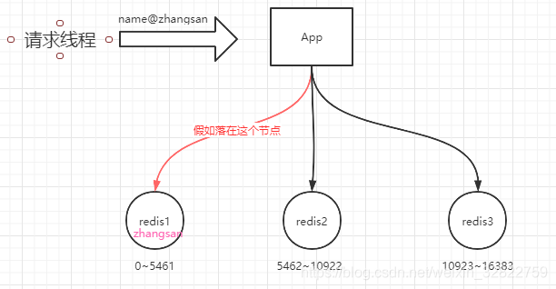
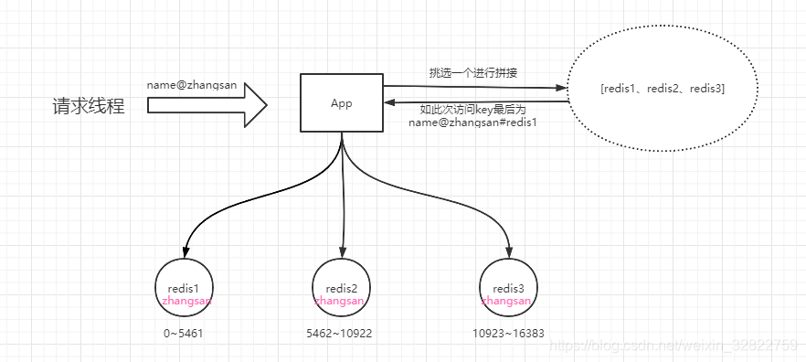

## 一、热点数据的存放

#### 场景：

数据库中有2000w数据，而redis中只有100w数据，如何保证redis中存放的都是热点数据？

**方案：**
限定redis占用的内存，redis会根据自身数据淘汰策略，留下热数据到内存。所以可以计算100w数据大约占用的内存，

然后设置一下redis内存限制即可，并将淘汰策略设置为allkeys-lru或者volatile-lru.

- **设置redis最大占用内存：**

　　　　打开redis配置文件，设置maxmemory参数，maxmemory是bytes字节类型哦！

　　　　maxmemory 268435456

- **设置过期策略：**

　　　　maxmemory-policy volatile-lru

1. 当redis使用的内存超过设置的最大内存时，会触发redis的key淘汰机制，在redis3.0中的6中淘汰策略如下：
2. noeviction :不删除策略。当达到最大内存限制时，如果需要使用更多内存，则直接返回错误信息（redis默认淘汰策略）
3. allkeys-lru:在所有key中优先删除最近最少使用（less recently used，LRU）的key。
4. allkeys-random:在所有key中随机删除一部分key
5. volatile-lru: 在设置了超时时间（expire）的key中优先删除最近最少使用的key
6. volatile-random：在设置了超时时间的key中随机删除一部分key
7. volatile-ttl: 在设置了超时时间的key中优先删除剩余时间（time to live,TTL）的key

**实际场景：**

**redis用作缓存**
提供一种简单实现缓存失效的思路: LRU(最近少用的淘汰)
即redis的缓存每命中一次,就给命中的缓存增加一定ttl(过期时间)(根据具体情况来设定, 比如10分钟).
一段时间后, 热数据的ttl都会较大, 不会自动失效, 而冷数据基本上过了设定的ttl就马上失效了.
**过去24h活跃用户**
比如用户数据。数据库有2000w条。使用 redis sortSet里 放两天内(为方便取一天内活跃用户)登录过的用户，登录一次ZADD一次，如set已存在则覆盖其分数（登录时间）。键：login:users，值：分数 时间戳、value userid。设置一个周期任务，比如每天03:00:00点删除sort set中前一天3点前的数据（保证set不无序增长、留近一天内活跃用户）。
取时，拿到当前时间戳（int 10位），再减1天就可按分数范围取过去24h活跃用户。

## 二、怎么发现热key

方法一:凭借业务经验，进行预估哪些是热key
其实这个方法还是挺有可行性的。比如某商品在做秒杀，那这个商品的key就可以判断出是热key。缺点很明显，并非所有业务都能预估出哪些key是热key。

方法二:在客户端进行收集
这个方式就是在操作redis之前，加入一行代码进行数据统计。那么这个数据统计的方式有很多种，也可以是给外部的通讯系统发送一个通知信息。缺点就是对客户端代码造成入侵。

方法三:在Proxy层做收集
有些集群架构是下面这样的，Proxy可以是Twemproxy，是统一的入口。可以在Proxy层做收集上报，但是缺点很明显，并非所有的redis集群架构都有proxy。 

方法四:用redis自带命令
(1)monitor命令，该命令可以实时抓取出redis服务器接收到的命令，然后写代码统计出热key是啥。当然，也有现成的分析工具可以给你使用，比如redis-faina。但是该命令在高并发的条件下，有内存增暴增的隐患，还会降低redis的性能。
(2)hotkeys参数，redis 4.0.3提供了redis-cli的热点key发现功能，执行redis-cli时加上–hotkeys选项即可。但是该参数在执行的时候，如果key比较多，执行起来比较慢。

方法五:自己抓包评估
Redis客户端使用TCP协议与服务端进行交互，通信协议采用的是RESP。自己写程序监听端口，按照RESP协议规则解析数据，进行分析。缺点就是开发成本高，维护困难，有丢包可能性。

以上五种方案，各有优缺点。根据自己业务场景进行抉择即可。那么发现热key后，如何解决呢？

## 三、高频访问热key的解决方案

**如何解决**
目前业内的方案有两种

**(1)利用二级缓存**
比如利用ehcache，或者一个HashMap都可以。在你发现热key以后，把热key加载到系统的JVM中。
针对这种热key请求，会直接从jvm中取，而不会走到redis层。
假设此时有十万个针对同一个key的请求过来,如果没有本地缓存，这十万个请求就直接怼到同一台redis上了。
现在假设，你的应用层有50台机器，OK，你也有jvm缓存了。这十万个请求平均分散开来，每个机器有2000个请求，会从JVM中取到value值，然后返回数据。避免了十万个请求怼到同一台redis上的情形。
***(2)备份热key\***
这个方案也很简单。不要让key走到同一台redis上不就行了。我们把这个key，在多个redis上都存一份不就好了。接下来，有热key请求进来的时候，我们就在有备份的redis上随机选取一台，进行访问取值，返回数据

 我们知道在Redis集群中，是通过按照槽点的划分来决定数据最终落在哪个Redis节点上。在集群中，一共存在16384个槽点，如果我们的集群有3个节点组成的话，那么由这3个节点来均分这16384个槽点。如下图

　　

​    假如name@zhangsan的缓存是一个高频访问的数据，那么大量请求访问这个key时，就会出现压力都有redis1这个节点来承担，这样redis1节点就有可能会扛不住压力而罢工了。那么应该怎么解决这个问题呢？

​    不妨在缓存数据的时候，将这个数据在每个redis节点都缓存一份。而在缓存的时候，将key在程序层面进行加工，如变成name@zhangsan#redis1、name@zhangsan#redis2、name@zhangsan#redis3这样的三个key。此处我们假如这样的3个key会根据crc16算法，将这个三个key分别落在这三个节点之上。那么这样在访问的时候，我们就可以依然遵循这个规则获得一个key，这样一来，获取数据的时候，压力就被分散到不同的redis节点上了。如图

