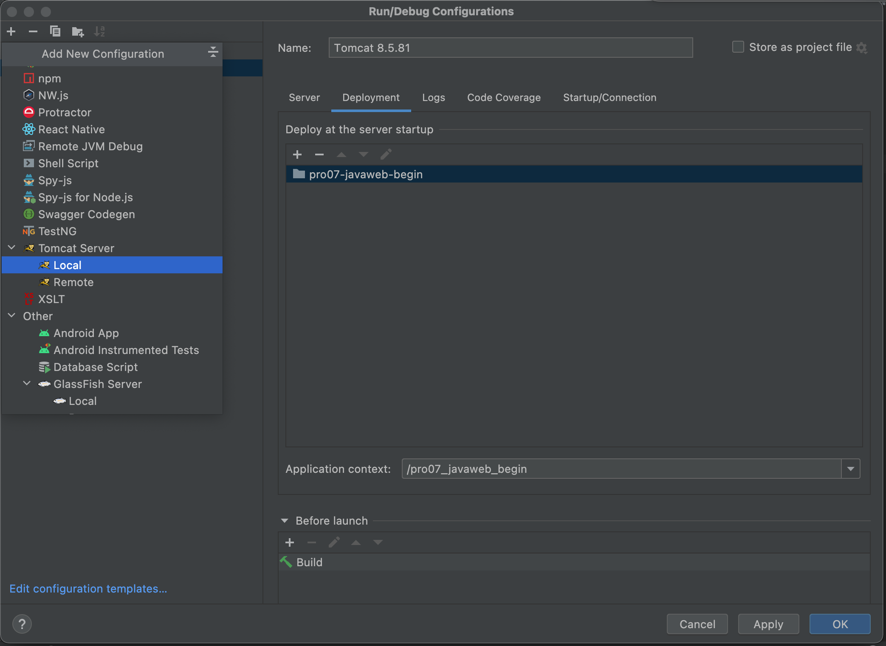
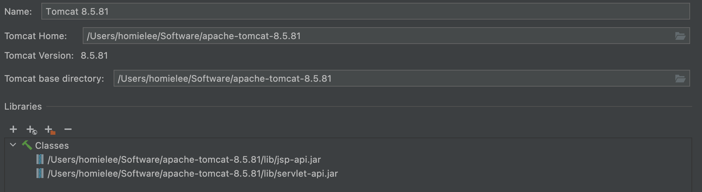
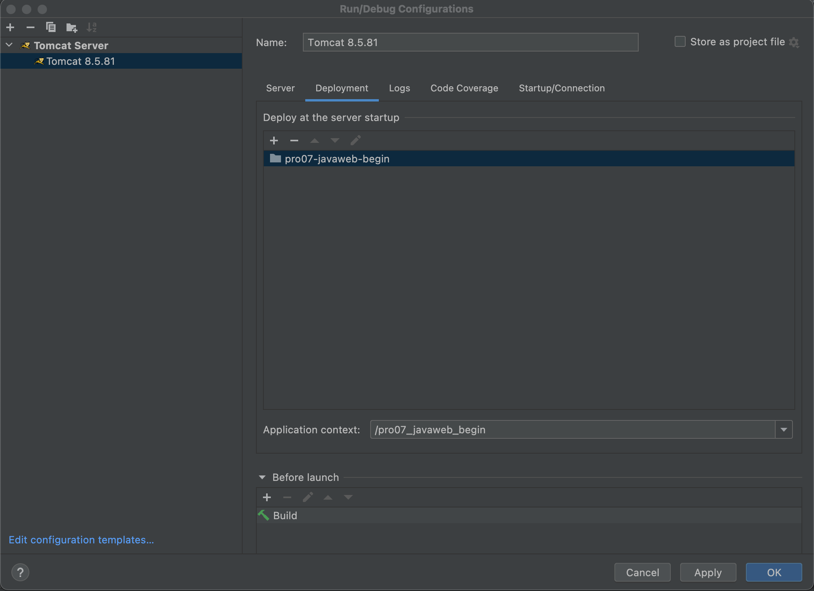
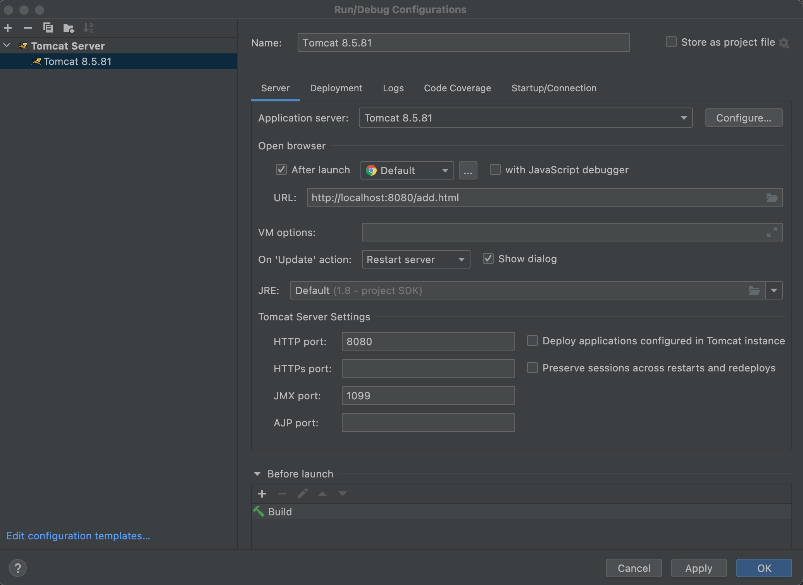

- 在创建项目的时候选择module并选择javaweb，之后就会出现同时带有web文件夹和src文件夹的一个项目

- 在web文件夹实现前端代码，在src实现后端代码

- 编写好代码之后就可以配置当前的运行环境了

  - 首先选择添加配置add configuration，选择tomcat server的local选项

    当然也可以先创建一个模板减少以后的工作量（在下面edit configuration templates一样选择tomcat server 的local）

  - 在application server中选择configure，之后选择自己本机的tomcat路径附[tomcat下载地址](https://tomcat.apache.org/)，解压之后选到tomcat home就好了

  - 之后就是deployment配置，选择deployment选项，+号添加external source，选择自己之前编写好的项目的context root（如果是只有这样一个会直接配置好），建议下面的application context也可以使用一个斜杠，这样的话之后在访问网址的时候就访问的时候简单一点（这一点在前面server选项卡的URL配置一项中会体现出同步的更改）

  - 最后在server的URL配置中配置打开浏览器之后要访问的网页

    尽量使用redeploy选项，使得每次更新资源之后能及时地看到更改。

- 其他注意事项：

  - 在.iml文件中注意导入的包的版本和实际在lib中的包版本是否统一，否则可能会出现500错误，很难debug
