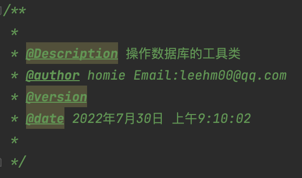

一、概述
    IDEA自带的注释模板不是太好用，我本人到网上搜集了很多资料系统的整理了一下制作了一份比较完整的模板来分享给大家，我不是专业玩博客的，写这篇文章只是为了让大家省事。

这里设置的注释模板采用Eclipse的格式，下面先贴出Eclipse的注释模板，我们就按照这种格式来设置：

类注释模板：                                                                   

​    

二、类注释模板
1、File-->settings-->Editor-->File and Code Templates-->Files

我们选择Class文件（当然你要设置接口的还也可以选择Interface文件）

（1）${NAME}：设置类名，与下面的\${NAME}一样才能获取到创建的类名

（2）TODO：代办事项的标记，一般生成类或方法都需要添加描述

（3）\${USER}、\${DATE}、\${TIME}：设置创建类的用户、创建的日期和时间，这些事IDEA内置的方法，还有一些其他的方法在绿色框标注的位置，比如你想添加项目名则可以使用${PROJECT_NAME}

（4）1.0：设置版本号，一般新创建的类都是1.0版本，自己改了多少次就写成多少


三、方法注释模板
1、创建模板
IDEA还没有智能到自动为我们创建方法注释，这就是要我们手动为方法添加注释，使用Eclipse时我们生成注释的习惯是

/**+Enter，这里我们也按照这种习惯来设置IDEA的方法注释

1、File-->Settings-->Editor-->Live Templates


（1）新建组：命名为userDefine


（2）新建模板：命名为*

因为IDEA生成注释的默认方式是：/\*+模板名+快捷键（比如若设置模板名为add快捷键用Tab，则生成方式为/*add+Tab），如果不采用这样的生成方式IDEA中没有内容的方法将不可用，例如获取方法参数的methodParameters(）、获取方法返回值的methodReturnType(）


（3）设置生成注释的快捷键

改成enter就好了

2、设置模板内容-IDEA格式模板
注意第一行，只有一个*而不是/*

在设置参数名时必须用${参数名}$的方式，否则第五步中读取不到你设置的参数名

```bash
*
 * @Author LiuMiss
 * @Description //TODO $end$
 * @Date $time$ $date$
 * @Param $param$
 * @return $return$
 **/
```

3、设置模板应用场景
点击模板页面最下方的警告，来设置将模板应用于那些场景，一般选择EveryWhere-->Java即可（如果曾经修改过，则显示为change而不是define）


5、设置参数
选择右侧的Edit variables按钮

PS:第4步和第5步顺序不可颠倒，否则第5步将获取不到方法


1、IDEA格式的模板只需要为每个参数选择对应的方法即可

2、JavaDoc格式的需要自定义参数以及返回值的实现方式

获取参数实现方式：

```
groovyScript("def result = '';def params = \"${_1}\".replaceAll('[\\\\[|\\\\]|\\\\s]', '').split(',').toList(); for(i = 0; i < params.size(); i++) {if(params[i] != '')result+='* @param ' + params[i] + ((i < params.size() - 1) ? '\\r\\n ' : '')}; return result == '' ? null : '\\r\\n ' + result", methodParameters())
```

返回值实现方式：

```
groovyScript("return \"${_1}\" == 'void' ? null : '\\r\\n * @return ' + \"${_1}\"", methodReturnType())
```

