# Overleaf 指南：30 分钟 LaTeX 入门

本文是对 Overleaf 提供的 [Learn LaTeX in 30 minutes](https://www.overleaf.com/learn/latex/Learn_LaTeX_in_30_minutes) （30 分钟 LaTeX 入门指南）的中文翻译。

在这份指南中，我们希望给你关于 \LaTeXLATEX 的首个介绍。这份指南不需要你在之前有任何关于 \LaTeXLATEX 的知识，跟随这份指南你将完成你的第一份 \LaTeXLATEX 文档，并将对 \LaTeXLATEX 提供的一些基本功能有很好的了解。

大纲 [[隐藏](https://imztj.cn/?p=3073#)]

- [1 什么是 LaTeX](https://imztj.cn/?p=3073#_LaTeX)
- [2 为什么要学习 LaTeX](https://imztj.cn/?p=3073#_LaTeX-2)
- [3 编写你的第一段 LaTeX](https://imztj.cn/?p=3073#_LaTeX-3)
- [4 文档的序言](https://imztj.cn/?p=3073#i)
- [5 添加标题、作者和日期](https://imztj.cn/?p=3073#i-2)
- [6 添加注释](https://imztj.cn/?p=3073#i-3)
- [7 加粗、斜体和下划线](https://imztj.cn/?p=3073#i-4)
- 8 添加图片
  - [8.1 标题、标签和引用](https://imztj.cn/?p=3073#i-6)
- 9 在 LaTeX 中创建列表
  - [9.1 无序列表](https://imztj.cn/?p=3073#i-7)
  - [9.2 有序列表](https://imztj.cn/?p=3073#i-8)
- [10 在 LaTeX 中添加数学表达式](https://imztj.cn/?p=3073#_LaTeX-5)
- 11 基本格式
  - [11.1 概要](https://imztj.cn/?p=3073#i-10)
  - [11.2 段落和新行](https://imztj.cn/?p=3073#i-11)
- [12 章节和分段](https://imztj.cn/?p=3073#i-12)
- 13 创建表格
  - [13.1 在 LaTeX 中创建一个简单的表格](https://imztj.cn/?p=3073#_LaTeX-6)
  - [13.2 添加边框](https://imztj.cn/?p=3073#i-14)
  - [13.3 标题、标签和引用](https://imztj.cn/?p=3073#i-15)
- [14 添加目录](https://imztj.cn/?p=3073#i-16)
- [15 下载你完成了的文档](https://imztj.cn/?p=3073#i-17)

## 什么是 LaTeX

\LaTeXLATEX（发音为 *LAY-tek* 或 *LAH-tek*）是一个用于创建具有专业外观的文档的工具。它基于所见即所得的思想，这意味着写作者只需要关注文档的内容，而计算机负责将其格式化。用户不再需要像 Microsoft Word 或 LibreOffice Writer 中那样，在页面上用空格来控制格式，而是只需要输入纯文本，让 \LaTeXLATEX 处理剩下一切。

## 为什么要学习 LaTeX

\LaTeXLATEX 被广泛应用于科学文档、书籍以及许多其他出版物。它不仅可以创建精美的排版文档，而且还使得用户可以很快速地处理复杂的排版问题，比如输入数学公式、创建目录、管理引用、创建书目、保持布局一致等等。由于可用的开源软件包数量众多（稍后会详细介绍），因此 \LaTeXLATEX 有无限的可能性。这些软件包赋予了用户更多的能力，例如添加脚注，绘制原理图，创建表格等。
人们使用 \LaTeXLATE​X 的最重要原因之一就是它分离了文档的内容与样式。这意味着你只需要编写文档的内容，我们就可以轻松更改其外观。同样，你也可以创建一个文档模板，用它来统一许多不同文档的外观，这样学术期刊可以创建投稿模板。这些模板具有预制的布局，只需要往里面添加内容即可。实际上，\LaTeXLATE​X 有数百种模板，覆盖从简历到幻灯片的所有内容。

## 编写你的第一段 LaTeX

第一步是创建一个新的 \LaTeXLATEX 项目。你可以在自己的电脑上创建 `.tex` 文件，也可以 [在 Overleaf 中启动新项目](https://www.overleaf.com/learn/Creating_a_document_in_Overleaf)。让我们从最简单的示例开始：

```tex
\documentclass{article}

\begin{document}
First document. This is a simple example, with no
extra parameters or packages included.
\end{document}
```

Copy

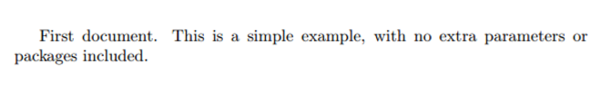

可以看到，\LaTeXLATEX 已经对文本进行了格式化（如，首行缩进）。下面我们仔细看一下上面这段代码每个部分的功能。

代码的第一行声明了文档的类型，称为 *类 (class)*。类控制文档的整体外观，不同类型的文档需要选择不同的类，比如，简历与论文需要不同的类。在这个例子中，类是 `article`，是最简单和最常见的 \LaTeXLATEX 类。其他类型的文档可能需要使用不同的类，例如 **book** 或 **report**。

然后，在 `\begin {document}` 和 `\end {document}` 这两个标记之间写入文档内容。这部分就是文档的 *主体 (body)*，你可以在此处开始编写和更改文本。要在 PDF 中查看更改的结果，必须首先编译文档。在 Overleaf 中只需单击 **重新编译（Recompile）**。还可以单击重新编译按钮旁边的小箭头，并将 “自动编译” 设置为 “开”，这样编辑文件时项目将会自动重新编译。

如果你使用的是文本编辑器，例如 gedit、emacs、vim、sublime、记事本等，就必须手动编译文档。编译文档的命令是 `pdflatex <your document>`。更多关于编译的信息请 [参见此处](https://en.wikibooks.org/wiki/LaTeX/Basics#Compilation)。

如果你使用的是专用的 LaTeX 编辑器（例如 TeXmaker 或 TeXworks），也只需单击 “重新编译” 按钮。如果不确定位置在哪里，请查阅程序文档。

现在我们已经了解了如何向我们的文档中添加内容，下一步就是撰写标题。为此，我们必须讲一下文档的 **序言 (preamble)**

## 文档的序言

在上一个示例中，文本是在 `\begin {document}` 命令之后输入的。在这个命令之前 `.tex` 文件中的所有内容都称为 **序言 (preamble)**。在序言中，可以定义要编写的文档的类型，要编写的语言，要使用的包（稍后会详细介绍）和其他的元素。例如，普通文档的序言如下所示：

```tex
\documentclass[12pt, letterpaper]{article}
\usepackage[utf8]{inputenc}
```

Copy

下面我们详细解释一下这两行的作用。

```
\documentclass[12pt, letterpaper]{article}
```

如前所述，这条命令定义了文档的类型。跟上个示例不一样的是，方括号中还有两个参数，这些参数必须用逗号分隔。在这个示例中，这两个额外的参数分别设置字体大小（`12pt`）和纸张大小（`letterpaper`）。当然，可以使用其他字体大小（`9pt`，`11pt`，`12pt` 等等），但是如果未指定，则默认的字体大小为 `10pt`。纸张尺寸还可以设置为 `a4paper` 和 `Legalpaper`；更多有关 [页面大小和边距](https://www.overleaf.com/learn/Page_size_and_margins) 的信息，可以参阅这篇文章。

```
\usepackage[utf8]{inputenc}
```

这行命令指定了文档的编码，可以省略或更改为其他编码，但建议使用 utf-8。除非特别需要其他编码，否则请将此行添加到序言中。

## 添加标题、作者和日期

要将标题、作者和日期添加到文档中，就必须 **在序言中**（不是文章的主体中）添加下面三行。它们是：

`\title{First document}`
这是文章的标题。

`\author{Hubert Farnsworth}`
在此处输入作者的姓名。

`\thanks{funded by the Overleaf team}`
在 `author` 命令的大括号里添加这条命令，可以添加上标和脚注。如果你需要在文章中感谢一个机构，这个功能将非常有用。

`\date{February 2014}`
你可以手动输入日期，或使用 `\today` 命令，以便在编译文档时自动更新日期。

现在，序言部分应该长这样：

```tex
\documentclass[12pt, letterpaper, twoside]{article}
\usepackage[utf8]{inputenc}

\title{First document}
\author{Hubert Farnsworth \thanks{funded by the Overleaf team}}
\date{February 2017}
```

Copy

现在，你已经为文档指定了标题、作者和日期，现在可以使用 `\maketitle` 命令在文档上打印这些信息。这条命令应该写在文档 **主体 (body)** 中你想要打印标题的位置。

```tex
\begin{document}

\maketitle

We have now added a title, author and date to our first \LaTeX{} document!

\end{document}
```

Copy

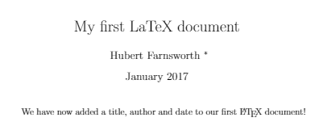

## 添加注释

与其他代码一样，注释是非常有用的。注释文本不会被打印，也不会以任何方式影响文档。在调试时，注释文本对于组织工作，做笔记或注释行 / 节很有用。要在 \LaTeXLATEX 中添加注释，只需在行首写一个％符号，如下所示：

```tex
\begin{document}

\maketitle

We have now added a title, author and date to our first \LaTeX{} document!

% This line here is a comment. It will not be printed in the document.

\end{document}
```

Copy

## 加粗、斜体和下划线

现在让我们来看一些简单的格式化命令。

- **加粗**：在 \LaTeXLATEX 中，加粗字体使用 `\textbf{}` 命令。
- *斜体*：在 \LaTeXLATEX 中，斜体使用 `\textit{}` 命令。
- 下划线：在 \LaTeXLATEX 中，下划线使用 `\underline{}` 命令。

下面是示例：

```tex
Some of the \textbf{greatest}
discoveries in \underline{science}
were made by \textbf{\textit{accident}}.
```

Copy

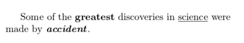

另一个非常有用的命令是 `\emph{...}` 命令。 `\emph` 是强调文本命令，她完成的操作取决于上下文：在普通文本中，强调的文本是斜体，但是如果在斜体文本中使用，则将文字变为普通文本，请参见以下示例：

```tex
Some of the greatest \emph{discoveries}
in science
were made by accident.

\textit{Some of the greatest \emph{discoveries}
in science
were made by accident.}

\textbf{Some of the greatest \emph{discoveries}
in science
were made by accident.}
```

Copy

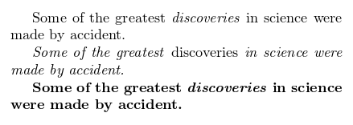

不过，有一些包（例如 [Beamer](https://www.overleaf.com/learn/Beamer)），会改变 `\emph` 命令的作用。

## 添加图片

现在我们来看，如何向 \LaTeXLATEX 文档添加图片。在 Overleaf 中，你需要首先上传图片。

下面是一个如何添加图片的示例：

```tex
\documentclass{article}
\usepackage{graphicx}
\graphicspath{{images/} }

\begin{document}
The universe is immense and it seems to be homogeneous,
in a large scale, everywhere we look at.

\includegraphics{universe}

There's a picture of a galaxy above
\end{document}
```

Copy

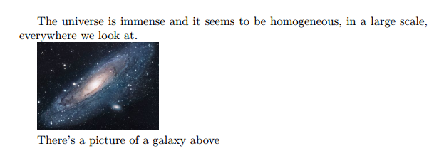

\LaTeXLATEX 本身不能管理图像，因此需要使用一个 *包 (package)*。包可用于更改 \LaTeXLATEX 文档的默认外观，或实现更多功能。在这个例子中，要实现在文档中添加图片，因此需要使用 `graphicx` 包。`graphicx` 包提供了新的命令 `\includegraphics{...}` 和 `\graphicspath{...}`。要使用 `graphicx` 软件包，要现在序言中添加：`\usepackage{graphicx}`

`\graphicspath{{images/} }` 告诉 \LaTeXLATEX，这些图像保存在当前目录下名为 images 的文件夹中。
`\includegraphics {universe}` 命令是将图像实际包含在文档中的命令。在这里，universe 是包含不带扩展名的图片文件的名称，图片文件名不应包含空格或多个点。

注意：\LaTeXLATEX 允许包含文件扩展名，但是最好忽略它。如果省略文件扩展名，它将提示 \LaTeXLATEX 搜索所有支持的格式。在上传图像文件时，通常也建议使用小写字母作为文件扩展名。有关更多详细信息，请参见有关 [生成高分辨率和低分辨率图像](https://www.overleaf.com/learn/latex/Learn_LaTeX_in_30_minutes#Generating_high-res_and_low-res_images) 的内容。

### 标题、标签和引用

我们可以像下面这样，在 `figure` 环境中对图片添加标题、标签和引用。

```tex
\begin{figure}[h]
    \centering
    \includegraphics[width=0.25\textwidth]{mesh}
    \caption{a nice plot}
    \label{fig:mesh1}
\end{figure}

As you can see in the figure \ref{fig:mesh1}, the
function grows near 0. Also, in the page \pageref{fig:mesh1}
is the same example.
```

Copy

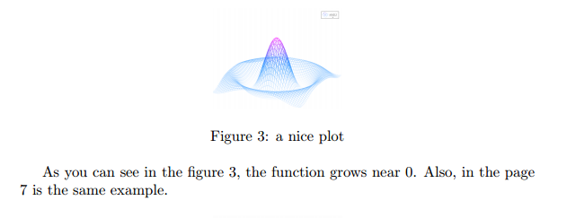

在这个示例中，有三个重要的命令：

- `\caption{a nice plot}`：此命令为图形设置标题。你可以将这条命令放置在图的上方或下方。
- `\label{fig:mesh1}`：如果你需要在文档中引用图像，请使用这条命令为图像设置标签。标签可以为图像编上号，并与下一个命令结合，对图片进行引用。
- `\ref{fig:mesh1}`：这条命令在编译后将显示替换为被引用图片对应的编号。

将图像放置在 \LaTeXLATEX 文档中时，应始终将它们放置在 `figure` 环境或类似环境中，以便 \LaTeXLATEX 适配图像和文字。

注意：如果你在自己的计算机上使用标题和引用功能，则必须两次编译文档才能使引用正常工作。Overleaf 会自动完成此操作。”

## 在 LaTeX 中创建列表

在 \LaTeXLATEX 中创建列表非常简单。你可以使用不同的 *环境 (environment)* 来创建不同形式的列表。环境 (environment) 是我们文档中具有不同呈现形式的各个部分。它们以 `\begin{...}` 命令开始，以 `\end{...}` 命令结束。

列表主要有两种类型，有序列表和无序列表。分别使用不同的环境。

### 无序列表

无序列表是由 `itemize` 环境生成的。每个条目之前必须有 `\item`，如下所示。

```tex
\begin{itemize}
  \item The individual entries are indicated with a black dot, a so-called bullet.
  \item The text in the entries may be of any length.
\end{itemize}
```

Copy

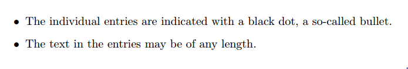

默认情况下，各个条目用黑点表示。条目中的文本可以是任何长度。

### 有序列表

有序列表在 `enumerate` 环境中创建，针对条目的语法与无序列表一致。

```tex
\begin{enumerate}
  \item This is the first entry in our list
  \item The list numbers increase with each entry we add
\end{enumerate}
```

Copy

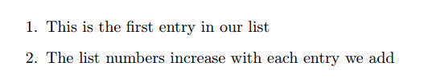

与无序列表一样，每个条目前必须添加 `\item`，它将自动生成标记该项目的数字，由从 1 开始。

## 在 LaTeX 中添加数学表达式

\LaTeXLATEX 的主要优点之一是易于编写数学表达式。\LaTeXLATEX 中有两种模式用于数学表达式：** 内联 (inline)** 模式和 **显示 (display)** 模式。第一种模式（内联）编写的公式是文本中的一部分，第二种模式（显示）编写的公式不在段落中，而是放在单独的行上。让我们看一个内联模式的例子：

```tex
In physics, the mass-energy equivalence is stated
by the equation E=mc^2, discovered in 1905 by Albert Einstein.
```

Copy

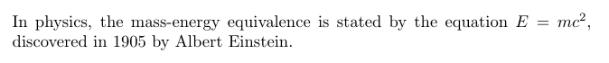

要在内联模式下添加数学表达式，可以使用以下定界符之一：`\(... \)`，`$ ... $` 或 `\begin{math} ... \end{math}`。它们作用相同，选择哪个完全取决于个人喜好。

而显示模式有两种版本：编号和非编号。

```tex
The mass-energy equivalence is described by the famous equation

\[E=mc^2 \]

discovered in 1905 by Albert Einstein.
In natural units (c = 1), the formula expresses the identity

\begin{equation}
E=m
\end{equation}
```

Copy

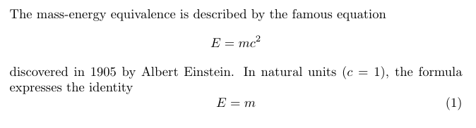

要在显示模式下打印方程式，可以使用以下定界符之一：`\[... \]`，`\begin{displaymath} ... \end{displaymath}` 或 `\begin{equation} ... \end{equation}`。[**不鼓励**](https://texfaq.org/FAQ-dolldoll) 使用 `$$ ... $$`，因为它会产生不一致的间距，而且可能不适用于某些数学软件包。

重要说明：equation* 环境是由外部软件包提供的，请参阅 [**amsmath** 文章](https://www.overleaf.com/learn/Aligning_equations)。

许多数学命令都需要用到 `amsmath` 包，因此在编写数学表达式时请确保引入了这个包。下面列举了一些基本的数学命令。

```tex
Subscripts in math mode are written as a_b and superscripts are written as a^b. These can be combined an nested to write expressions such as

% 上标和下表分别用 a_b 和 a^b，将它们组合起来使用可以写出下面的表达式。

\[T^{i_1 i_2 \dots i_p}_{j_1 j_2 \dots j_q} = T(x^{i_1},\dots,x^{i_p},e_{j_1},\dots,e_{j_q}) \]

We write integrals using \int and fractions using \frac{a}{b}. Limits are placed on integrals using superscripts and subscripts:

% 我们使用 \int 编写积分，使用 \frac{a}{b} 编写分数。极限使用上标和下标放置在积分上：

\[\int_0^1 \frac{1}{e^x} =  \frac{e-1}{e} \]

Lower case Greek letters are written as \omega \delta etc. while upper case Greek letters are written as \Omega \Delta.

% 小写希腊字母像这样写：\omega \delta，大写希腊字母像这样写：\Omega \Delta

Mathematical operators are prefixed with a backslash as \sin(\beta), \cos(\alpha), \log(x) etc.

% 数学运算符的前缀为反斜杠，例如 \sin(\beta), \cos(\alpha), \log(x) 等。
```

Copy

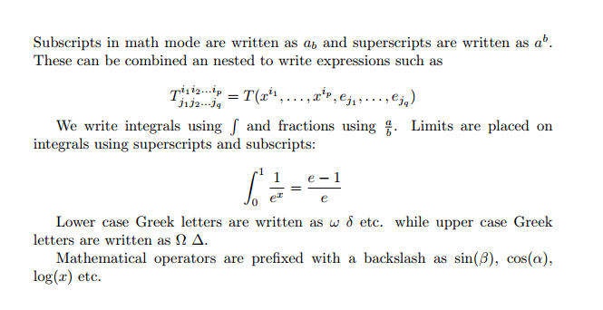

还有太多有关在 \LaTeXLATEX 中书写数学表达式的知识无法在这里一一提及。可以查看下面这些文章：

- [Mathematical expressions](https://www.overleaf.com/learn/Mathematical_expressions)
- [Subscripts and superscripts](https://www.overleaf.com/learn/Subscripts_and_superscripts)
- [Brackets and Parentheses](https://www.overleaf.com/learn/Brackets_and_Parentheses)
- [Fractions and Binomials](https://www.overleaf.com/learn/Fractions_and_Binomials)
- [Aligning Equations](https://www.overleaf.com/learn/Operators)
- [Operators](https://www.overleaf.com/learn/Operators)
- [Spacing in math mode](https://www.overleaf.com/learn/Spacing_in_math_mode)
- [Integrals, sums and limits](https://www.overleaf.com/learn/Integrals,_sums_and_limits)
- [Display style in math mode](https://www.overleaf.com/learn/Display_style_in_math_mode)
- [List of Greek letters and math symbols](https://www.overleaf.com/learn/List_of_Greek_letters_and_math_symbols)
- [Mathematical fonts](https://www.overleaf.com/learn/Mathematical_fonts)

## 基本格式

现在，我们来研究如何编写摘要以，及如何将 \LaTeXLATEX 文档格式化为不同的章节，分节和段落。

### 概要

在科学文献中，通常会在概要部分里面简述论文的主要内容。在 \LaTeXLATEX 中有针对概要部分设计的环境。概要环境会将文本以特殊格式放在文档顶部。

```tex
\begin{document}

\begin{abstract}
This is a simple paragraph at the beginning of the
document. A brief introduction about the main subject.
\end{abstract}
\end{document}
```

Copy

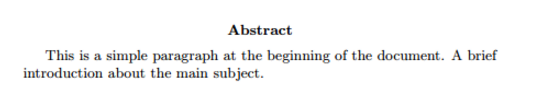

### 段落和新行

```tex
\begin{document}

\begin{abstract}
This is a simple paragraph at the beginning of the
document. A brief introduction about the main subject.
\end{abstract}

Now that we have written our abstract, we can begin writing our first paragraph.

This line will start a second Paragraph.
\end{document}
```

Copy

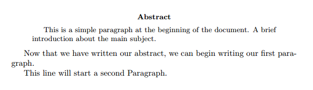

编写文档内容时，如果需要开始新段落，则必须按两次 “Enter” 键（以插入双空行）。注意，\LaTeXLATEX 会自动缩进段落。
要在开始新段落的情况下开始新行，请插入一个 *换行点*，可以通过 `\\`（在示例中为双反斜杠）或 `\newline` 命令来完成。

注意不要使用多个 `\\` 或 `\newlines` 来 “模拟” 段落之间具有较大间距，因为这可能会干扰 \LaTeXLATEX 的排版算法。推荐的方法是继续使用双空行来创建没有任何 `\\` 的新段落，然后将 `\usepackage{parskip}` 添加到序言中。

你可以在这篇有关 [段落和换行](https://www.overleaf.com/learn/Paragraphs_and_new_lines) 的文章中找到更多信息。

## 章节和分段

用来组织文档的命令因文档类型而异，最简单的组织形式是分节，它对所有文档格式均可用。

```tex
\chapter{First Chapter}

\section{Introduction}

This is the first section.

Lorem  ipsum  dolor  sit  amet,  consectetuer  adipiscing
elit.   Etiam  lobortisfacilisis sem.  Nullam nec mi et
neque pharetra sollicitudin.  Praesent imperdietmi nec ante.
Donec ullamcorper, felis non sodales...

\section{Second Section}

Lorem ipsum dolor sit amet, consectetuer adipiscing elit.
Etiam lobortis facilisissem.  Nullam nec mi et neque pharetra
sollicitudin.  Praesent imperdiet mi necante...

\subsection{First Subsection}
Praesent imperdietmi nec ante. Donec ullamcorper, felis non sodales...

\section*{Unnumbered Section}
Lorem ipsum dolor sit amet, consectetuer adipiscing elit.
Etiam lobortis facilisissem
```

Copy

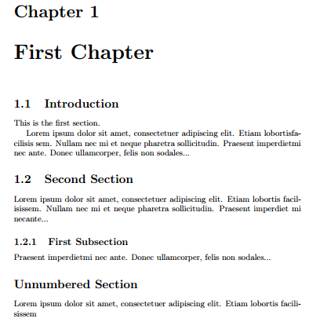

命令 `\section{}` 标记一个新分节的开始，在大括号内设置标题。分节编号是自动的，也可以通过在命令中加一个 * 来禁用编号，像这样：`\section*{}`。我们也可以有 `\subsection{}`，甚至 `\subsubsection{}`。下面列出了基本的标题深度级别：

| 深度 | 标记                          |
| ---- | ----------------------------- |
| -1   | \part{part}                   |
| 0    | \chapter{chapter}             |
| 1    | \section{section}             |
| 2    | \subsection{subsection}       |
| 3    | \subsubsection{subsubsection} |
| 4    | \paragraph{paragraph}         |
| 5    | \subparagraph{subparagraph}   |

请注意，`\part` 和 `\chapter` 仅在 report 和 book 类中可用。
有关文档结构的更完整讨论，请参阅 [这篇文章](https://www.overleaf.com/learn/Sections_and_chapters)。

## 创建表格

### 在 LaTeX 中创建一个简单的表格

```tex
\begin{center}
\begin{tabular}{ c c c }
 cell1 & cell2 & cell3 \\
 cell4 & cell5 & cell6 \\
 cell7 & cell8 & cell9
\end{tabular}
\end{center}
```

Copy

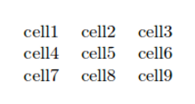

`tabular` 环境是创建表的默认 \LaTeXLATEX 方法。你必须为此环境指定一个参数，这个例子里是 {c c c}。这告诉 \LaTeXLATEX，表格将有三列，每列中的文本必须居中。你还可以使用 `r` 将文本向右对齐，使用 `l` 进行左对齐。符号 `&` 是分隔符，每行中的分隔符必须始终少于列数。要转到表格的下一行，需要使用换行命令 `\\`。我们将整个表包装在 `center` 环境中，以让它出现在页面的中心。

### 添加边框

`tabular` 环境很灵活，你可以在每列之间放置分隔线。

```tex
\begin{center}
\begin{tabular}{ |c|c|c| }
 \hline
 cell1 & cell2 & cell3 \\
 cell4 & cell5 & cell6 \\
 cell7 & cell8 & cell9 \\
 \hline
\end{tabular}
\end{center}
```

Copy

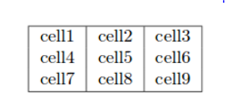

你可以使用水平线命令 `\hline` 和垂直线参数 `|` 来添加边框。

- `{|c|c|c|}`：这声明表中将会有由垂直线分隔的三列。`|` 符号指定这些列应由垂直线分隔。
- `\hline`：这条命令将插入一条水平线。这个示例中，我们在表格的顶部和底部加入了水平线。`\hline` 的使用次数没有限制。

在下面你可以看到第二个示例。

```tex
\begin{center}
 \begin{tabular}{||c c c c||}
 \hline
 Col1 & Col2 & Col2 & Col3 \\ [0.5ex]
 \hline\hline
 1 & 6 & 87837 & 787 \\
 \hline
 2 & 7 & 78 & 5415 \\
 \hline
 3 & 545 & 778 & 7507 \\
 \hline
 4 & 545 & 18744 & 7560 \\
 \hline
 5 & 88 & 788 & 6344 \\ [1ex]
 \hline
\end{tabular}
\end{center}
```

Copy

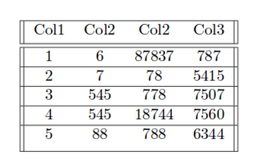

在 \LaTeXLATEX 中创建表有时会有些棘手，因此你可能需要 [TablesGenerator.com](https://www.tablesgenerator.com/) 这样的在线工具导出表格的 \LaTeXLATEX 代码。*“文件”>“粘贴表数据”* 选项从电子表格软件粘贴数据。

### 标题、标签和引用

你可以使用与图片几乎相同的方式来为表格添加标题、标签和引用。唯一的区别是，使用 `table` 环境代替了 `figure` 环境。

```tex
Table \ref{table:data} is an example of referenced \LaTeX{} elements.

\begin{table}[h!]
\centering
\begin{tabular}{||c c c c||}
 \hline
 Col1 & Col2 & Col2 & Col3 \\ [0.5ex]
 \hline\hline
 1 & 6 & 87837 & 787 \\
 2 & 7 & 78 & 5415 \\
 3 & 545 & 778 & 7507 \\
 4 & 545 & 18744 & 7560 \\
 5 & 88 & 788 & 6344 \\ [1ex]
 \hline
\end{tabular}
\caption{Table to test captions and labels}
\label{table:data}
\end{table}
```

Copy

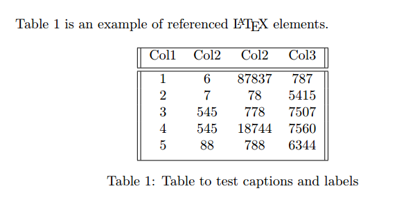

注意：如果你在自己的计算机上使用标题和引用功能，则必须两次编译文档才能使引用正常工作。Overleaf 会自动完成此操作

## 添加目录

创建目录很简单，使用 `\tableofcontents` 即可完成所有工作：

```tex
\documentclass{article}
\usepackage[utf8]{inputenc}

\title{Sections and Chapters}
\author{Gubert Farnsworth}
\date{ }

\begin{document}

\maketitle

\tableofcontents

\section{Introduction}

This is the first section.

Lorem  ipsum  dolor  sit  amet,  consectetuer  adipiscing
elit.   Etiam  lobortisfacilisis sem.  Nullam nec mi et
neque pharetra sollicitudin.  Praesent imperdietmi nec ante.
Donec ullamcorper, felis non sodales...

\addcontentsline{toc}{section}{Unnumbered Section}
\section*{Unnumbered Section}

Lorem ipsum dolor sit amet, consectetuer adipiscing elit.
Etiam lobortis facilisissem.  Nullam nec mi et neque pharetra
sollicitudin.  Praesent imperdiet mi necante...

\section{Second Section}

Lorem ipsum dolor sit amet, consectetuer adipiscing elit.
Etiam lobortis facilisissem.  Nullam nec mi et neque pharetra
sollicitudin.  Praesent imperdiet mi necante...

\end{document}
```

Copy

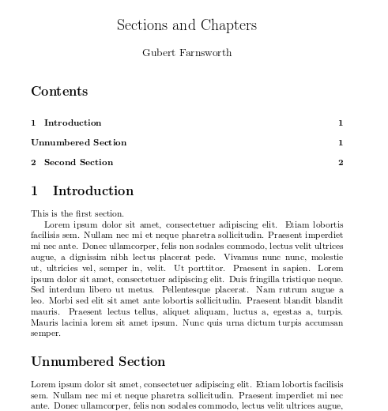

section/subsection/chapter 将会自动加入目录当中。如果需要加入手动添加目录条目，比如需要将非编号的 section 加入目录，需要使用 `\addcontentsline`，像示例中那样。

## 下载你完成了的文档

你可以通过单击左上角的 “菜单” 按钮来下载完成的 PDF。还有一个更快的方法，就是单击 PDF 查看器上的 “下载 PDF” 按钮，如下所示。

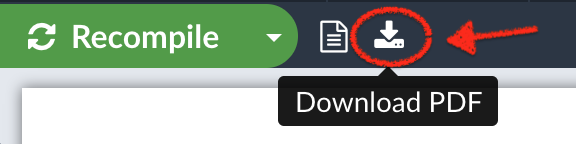

参考：

[Overleaf 指南：30 分钟 LaTeX 入门](https://imztj.cn/?p=3073)
