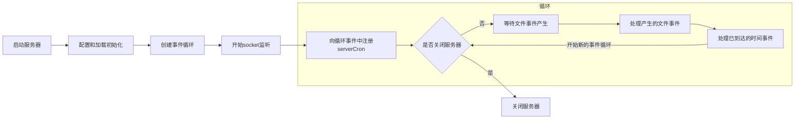
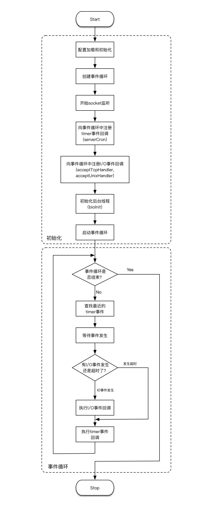

## redis事件

### 数据结构

```c
//事件处理器状态(同时是时间处理器和文件处理器)
typedef struct aeEventLoop {
    //当前注册的最大描述符
    int maxfd;   /* highest file descriptor currently registered */
    //当前追踪的最大描述符
    int setsize; /* max number of file descriptors tracked */
    //时间事件的id,时间事件链表中记录了最大的id
    long long timeEventNextId;
    //已注册的文件事件
    aeFileEvent *events; /* Registered events */
    //已经就绪,执行过处理器的文件事件
    aeFiredEvent *fired; /* Fired events */
    //时间事件
    aeTimeEvent *timeEventHead;
    //事件处理器开关
    int stop;
    //多路复用库的私有数据
    void *apidata; /* This is used for polling API specific data */
    //处理事件之前要执行的函数
    aeBeforeSleepProc *beforesleep;
    //处理事件之后要执行的函数
    aeBeforeSleepProc *aftersleep;
    int flags;
} aeEventLoop;
```


### 文件事件

服务器通过套接字和客户端连接,文件事件是对于套接字操作的抽象,通信过程会产生相应文件事件,服务器监听处理这些事件

- **本身单线程运行,但是I/O多路复用监听多个套接字**

#### 数据结构

```c
/* File event structure
 *
 * 文件事件结构
 */
typedef struct aeFileEvent {

    // 监听事件类型掩码，
    // 值可以是 AE_READABLE 或 AE_WRITABLE ，
    // 或者 AE_READABLE | AE_WRITABLE
    int mask; /* one of AE_(READABLE|WRITABLE) */

    // 读事件处理器
    aeFileProc *rfileProc;

    // 写事件处理器
    aeFileProc *wfileProc;

    // 多路复用库的私有数据
    void *clientData;

} aeFileEvent;
```


#### 构成

- 套接字
  - 每当一个套接字准备好执行某项操作时,产生一个文件事件,一个服务器连接了多个套接字,可以产生多个文件事件
  - 当套接字可读(客户端执行write或者close之后)或者有新的可应答套接字出现(新的connect建立)时,产生AE_READABLE事件;套接字变得可写(客户端执行read操作之后)时,产生AE_WRITABLE事件

- I/O多路复用程序
  - 负责监听多个套接字的上述两种事件,向文件事件分派器传送产生了事件的套接字
  - 多个事件时先处理AE_READABLE事件,先读后写,多个套接字都有事件时按照一个队列传送,当上一个套接字的事件处理完毕之后再处理下一个套接字

- 文件事件分派器
  - 根据传来的套接字调用相应的事件处理器

- 事件处理器
  - 执行相关操作的函数


#### 相关API

- 函数aeCreateFileEvent

  ```c
  /*
   * 根据 mask 参数的值，监听 fd 文件的状态，
   * 当 fd 可用时，执行 proc 函数
   * 将给定套接字的给定事件加入到I/O多路复用程序的监听范围
   * 将事件和事件处理器关联
   */
  int aeCreateFileEvent(aeEventLoop *eventLoop, int fd, int mask,
          aeFileProc *proc, void *clientData)
  {
      if (fd >= eventLoop->setsize) {
          errno = ERANGE;
          return AE_ERR;
      }
      // 取出文件事件结构
      aeFileEvent *fe = &eventLoop->events[fd];
  
      if (aeApiAddEvent(eventLoop, fd, mask) == -1)
          return AE_ERR;
      // 设置文件事件类型，以及事件的处理器
      fe->mask |= mask;
      if (mask & AE_READABLE) fe->rfileProc = proc;
      if (mask & AE_WRITABLE) fe->wfileProc = proc;
      // 私有数据
      fe->clientData = clientData;
      // 如果有需要，更新事件处理器的最大 fd
      if (fd > eventLoop->maxfd)
          eventLoop->maxfd = fd;
      return AE_OK;
  }
  ```

- 函数aeDeleteFileEvent

  ```c
  /*
   * 将 fd 从 mask 指定的监听队列中删除
   * i/o多路复用程序取消对给定套接字的给定事件的监听
   * 取消事件和事件处理器之间的关联
   */
  void aeDeleteFileEvent(aeEventLoop *eventLoop, int fd, int mask)
  {
      if (fd >= eventLoop->setsize) return;
      // 取出文件事件结构
      aeFileEvent *fe = &eventLoop->events[fd];
      // 未设置监听的事件类型，直接返回
      if (fe->mask == AE_NONE) return;
  
      /* We want to always remove AE_BARRIER if set when AE_WRITABLE
       * is removed. */
      if (mask & AE_WRITABLE) mask |= AE_BARRIER;
      // 取消对给定 fd 的给定事件的监视
      aeApiDelEvent(eventLoop, fd, mask);
      // 计算新掩码
      fe->mask = fe->mask & (~mask);
      if (fd == eventLoop->maxfd && fe->mask == AE_NONE) {
          /* Update the max fd */
          int j;
  
          for (j = eventLoop->maxfd-1; j >= 0; j--)
              if (eventLoop->events[j].mask != AE_NONE) break;
          eventLoop->maxfd = j;
      }
  }
  ```

- 函数aeGetFileEvents

  ```c
  /*
   * 获取给定 fd 正在监听的事件类型
   * 返回正在监视的事件类型
   */
  int aeGetFileEvents(aeEventLoop *eventLoop, int fd) {
      if (fd >= eventLoop->setsize) return 0;
      aeFileEvent *fe = &eventLoop->events[fd];
  
      return fe->mask;
  }
  ```

- 函数aeWait

  ```c
  /* Wait for milliseconds until the given file descriptor becomes
   * writable/readable/exception
   * 在给定毫秒内等待，直到 fd 变成可写、可读或异常
   * 事件成功产生或者超时就返回 */
  int aeWait(int fd, int mask, long long milliseconds) {
      struct pollfd pfd;
      int retmask = 0, retval;
  
      memset(&pfd, 0, sizeof(pfd));
      pfd.fd = fd;
      if (mask & AE_READABLE) pfd.events |= POLLIN;
      if (mask & AE_WRITABLE) pfd.events |= POLLOUT;
  
      if ((retval = poll(&pfd, 1, milliseconds))== 1) {
          if (pfd.revents & POLLIN) retmask |= AE_READABLE;
          if (pfd.revents & POLLOUT) retmask |= AE_WRITABLE;
          if (pfd.revents & POLLERR) retmask |= AE_WRITABLE;
          if (pfd.revents & POLLHUP) retmask |= AE_WRITABLE;
          return retmask;
      } else {
          return retval;
      }
  }
  ```

- 函数aeApiPoll

  ```c
  /*在指定时间内阻塞并等待所有被aeCreateFileEvent函数设置为监听状态的套接字产生文件事件
  当有至少一个事件产生或者超时返回*/
  static int aeApiPoll(aeEventLoop *eventLoop, struct timeval *tvp) {
      aeApiState *state = eventLoop->apidata;
      int retval, j, numevents = 0;
  
      memcpy(&state->_rfds,&state->rfds,sizeof(fd_set));
      memcpy(&state->_wfds,&state->wfds,sizeof(fd_set));
  	//根据select的retval决定之后的操作
      retval = select(eventLoop->maxfd+1,
                  &state->_rfds,&state->_wfds,NULL,tvp);
      if (retval > 0) {
          for (j = 0; j <= eventLoop->maxfd; j++) {
              int mask = 0;
              aeFileEvent *fe = &eventLoop->events[j];
  			//监听得到的事件类型
              if (fe->mask == AE_NONE) continue;
              if (fe->mask & AE_READABLE && FD_ISSET(j,&state->_rfds))
                  mask |= AE_READABLE;
              if (fe->mask & AE_WRITABLE && FD_ISSET(j,&state->_wfds))
                  mask |= AE_WRITABLE;
              eventLoop->fired[numevents].fd = j;
              eventLoop->fired[numevents].mask = mask;
              numevents++;
          }
      } else if (retval == -1 && errno != EINTR) {
          panic("aeApiPoll: select, %s", strerror(errno));
      }
  
      return numevents;
  }
  ```

- 函数aeProcessEvents

  ```c
  /* 调用aeApiPoll等待事件产生,之后遍历所有产生的事件,处理所有已到达的时间事件，以及所有已就绪的文件事件
   * 如果不传入特殊 flags 的话，那么函数睡眠直到文件事件就绪，
   * 或者下个时间事件到达（如果有的话）
   * 根据flag值确定相应的处理步骤
   * 函数的返回值为已处理事件的数量*/
  int aeProcessEvents(aeEventLoop *eventLoop, int flags)
  {
      int processed = 0, numevents;
  
      /* Nothing to do? return ASAP */
      if (!(flags & AE_TIME_EVENTS) && !(flags & AE_FILE_EVENTS)) return 0;
  
      /* Note that we want to call select() even if there are no
       * file events to process as long as we want to process time
       * events, in order to sleep until the next time event is ready
       * to fire. */
      if (eventLoop->maxfd != -1 ||
          ((flags & AE_TIME_EVENTS) && !(flags & AE_DONT_WAIT))) {
          int j;
          struct timeval tv, *tvp;
          int64_t usUntilTimer = -1;
          // 距今最近的时间事件还要多久才能达到,使用usUntilTimer保存
          if (flags & AE_TIME_EVENTS && !(flags & AE_DONT_WAIT))
              usUntilTimer = usUntilEarliestTimer(eventLoop);
          //还没有到达
          if (usUntilTimer >= 0) {
              tv.tv_sec = usUntilTimer / 1000000;
              tv.tv_usec = usUntilTimer % 1000000;
              tvp = &tv;
          } else {
              //如果时间事件已经到达(到达间隔时间为负数),将已到达时间事件的到达时间间隔设置为0
              /* If we have to check for events but need to return
               * ASAP because of AE_DONT_WAIT we need to set the timeout
               * to zero */
              // 执行到这一步，说明没有时间事件即将到达
              // 那么根据 AE_DONT_WAIT 是否设置来决定是否阻塞，以及阻塞的时间长度
              if (flags & AE_DONT_WAIT) {
                  // 设置文件事件不阻塞,将已到达时间事件的到达时间间隔设置为0
                  tv.tv_sec = tv.tv_usec = 0;
                  tvp = &tv;
              } else {
                  /* Otherwise we can block */
                  // 文件事件可以阻塞直到有事件到达为止,wait时间设置为无穷
                  tvp = NULL; /* wait forever */
              }
          }
  
          if (eventLoop->flags & AE_DONT_WAIT) {
              tv.tv_sec = tv.tv_usec = 0;
              tvp = &tv;
          }
  
          if (eventLoop->beforesleep != NULL && flags & AE_CALL_BEFORE_SLEEP)
              eventLoop->beforesleep(eventLoop);
  
          /* Call the multiplexing API, will return only on timeout or when
           * some event fires. */
          // 处理文件事件，阻塞时间由 tvp 决定
          numevents = aeApiPoll(eventLoop, tvp);
  
          /* After sleep callback. */
          if (eventLoop->aftersleep != NULL && flags & AE_CALL_AFTER_SLEEP)
              eventLoop->aftersleep(eventLoop);
  
          for (j = 0; j < numevents; j++) {
              //从已就绪数组中获取事件
              int fd = eventLoop->fired[j].fd;
              aeFileEvent *fe = &eventLoop->events[fd];
              int mask = eventLoop->fired[j].mask;
              int fired = 0; /* Number of events fired for current fd. */
              int invert = fe->mask & AE_BARRIER;
              //读取事件
              if (!invert && fe->mask & mask & AE_READABLE) {
                  //确保读/写事件只能执行其中一个
                  fe->rfileProc(eventLoop,fd,fe->clientData,mask);
                  fired++;
                  fe = &eventLoop->events[fd]; /* Refresh in case of resize. */
              }
  
              /* Fire the writable event. */
              //写事件
              if (fe->mask & mask & AE_WRITABLE) {
                  if (!fired || fe->wfileProc != fe->rfileProc) {
                      fe->wfileProc(eventLoop,fd,fe->clientData,mask);
                      fired++;
                  }
              }
  
              /* If we have to invert the call, fire the readable event now
               * after the writable one. */
              if (invert) {
                  fe = &eventLoop->events[fd]; /* Refresh in case of resize. */
                  if ((fe->mask & mask & AE_READABLE) &&
                      (!fired || fe->wfileProc != fe->rfileProc))
                  {
                      fe->rfileProc(eventLoop,fd,fe->clientData,mask);
                      fired++;
                  }
              }
  
              processed++;
          }
      }
      /* Check time events */
      //执行时间事件
      if (flags & AE_TIME_EVENTS)
          processed += processTimeEvents(eventLoop);
  
      return processed; /* return the number of processed file/time events */
  }
  
  ```

#### 文件事件处理器

实现不同的网络通信需求,主要是连接应答处理器,命令请求处理器,命令回复处理器

- 连接应答处理器

  - 函数acceptTcpHandler对连接服务器监听套接字的客户端进行应答

    ```c
    //创建一个TCP连接
    void acceptTcpHandler(aeEventLoop *el, int fd, void *privdata, int mask) {
        int cport, cfd, max = MAX_ACCEPTS_PER_CALL;
        char cip[NET_IP_STR_LEN];
        UNUSED(el);
        UNUSED(mask);
        UNUSED(privdata);
    
        while(max--) {
            //accept客户端连接
            cfd = anetTcpAccept(server.neterr, fd, cip, sizeof(cip), &cport);//TCP连接函数
            if (cfd == ANET_ERR) {
                if (errno != EWOULDBLOCK)
                    serverLog(LL_WARNING,
                        "Accepting client connection: %s", server.neterr);
                return;
            }
            serverLog(LL_VERBOSE,"Accepted %s:%d", cip, cport);
            // 为客户端创建客户端状态（redisClient）
            acceptCommonHandler(connCreateAcceptedSocket(cfd),0,cip);
        }
    }
    ```

    redis进行初始化时,将处理器与套接字的AE_READABLE事件连接起来,当由客户端使用sys/socket.h/connect函数连接服务器监听套接字时,套接字产生AE_READABLE事件,引发连接应答处理器执行,并执行相应的套接字应答操作

    ```mermaid
    graph LR
    
      a((客户端))--连接监听套接字-->b[服务器:服务器监听套接字产生的AE_READABLE事件,执行连接应答处理器]
    ```

    

- 命令请求处理器

  - 函数readQueryFromClient从套接字中读入客户端发送的命令请求内容

    ```c
    /*
     * 读取客户端的查询缓冲区内容
     */
    void readQueryFromClient(connection *conn) {
        client *c = connGetPrivateData(conn);
        int nread, big_arg = 0;
        size_t qblen, readlen;
    
        /* Check if we want to read from the client later when exiting from
         * the event loop. This is the case if threaded I/O is enabled. */
        if (postponeClientRead(c)) return;
    
        /* Update total number of reads on server */
        //更新server的读入处理计数器
        atomicIncr(server.stat_total_reads_processed, 1);
    
        readlen = PROTO_IOBUF_LEN;
        /* If this is a multi bulk request, and we are processing a bulk reply
         * that is large enough, try to maximize the probability that the query
         * buffer contains exactly the SDS string representing the object, even
         * at the risk of requiring more read(2) calls. This way the function
         * processMultiBulkBuffer() can avoid copying buffers to create the
         * Redis Object representing the argument. */
        if (c->reqtype == PROTO_REQ_MULTIBULK && c->multibulklen && c->bulklen != -1
            && c->bulklen >= PROTO_MBULK_BIG_ARG)
        {
            ssize_t remaining = (size_t)(c->bulklen+2)-sdslen(c->querybuf);
            big_arg = 1;
    
            /* Note that the 'remaining' variable may be zero in some edge case,
             * for example once we resume a blocked client after CLIENT PAUSE. */
            if (remaining > 0) readlen = remaining;
        }
        // 获取查询缓冲区当前内容的长度
        // 如果读取出现 short read ，那么可能会有内容滞留在读取缓冲区里面
        // 这些滞留内容也许不能完整构成一个符合协议的命令
        qblen = sdslen(c->querybuf);
        //为查询缓冲区分配空间
        if (big_arg || sdsalloc(c->querybuf) < PROTO_IOBUF_LEN) {
            /* When reading a BIG_ARG we won't be reading more than that one arg
             * into the query buffer, so we don't need to pre-allocate more than we
             * need, so using the non-greedy growing. For an initial allocation of
             * the query buffer, we also don't wanna use the greedy growth, in order
             * to avoid collision with the RESIZE_THRESHOLD mechanism. */
            //太长的指令参数只读入一个参数,查询缓冲区不需要多余分配空间,不使用贪心分配空间
            c->querybuf = sdsMakeRoomForNonGreedy(c->querybuf, readlen);
        } else {
            c->querybuf = sdsMakeRoomFor(c->querybuf, readlen);
    
            /* Read as much as possible from the socket to save read(2) system calls. */
            readlen = sdsavail(c->querybuf);
        }
        //读入内容到查询缓存
        nread = connRead(c->conn, c->querybuf+qblen, readlen);
        //读入出错时
        if (nread == -1) {
            if (connGetState(conn) == CONN_STATE_CONNECTED) {
                return;
            } else {
                serverLog(LL_VERBOSE, "Reading from client: %s",connGetLastError(c->conn));
                freeClientAsync(c);
                return;
            }
        //遇到EOF
        } else if (nread == 0) {
            if (server.verbosity <= LL_VERBOSE) {
                sds info = catClientInfoString(sdsempty(), c);
                serverLog(LL_VERBOSE, "Client closed connection %s", info);
                sdsfree(info);
            }
            freeClientAsync(c);
            return;
        } else if (c->flags & CLIENT_MASTER) {
            /* Append the query buffer to the pending (not applied) buffer
             * of the master. We'll use this buffer later in order to have a
             * copy of the string applied by the last command executed. */
            // 根据内容，更新查询缓冲区（SDS） free 和 len 属性
            // 并将 '\0' 正确地放到内容的最后
            c->pending_querybuf = sdscatlen(c->pending_querybuf,
                                            c->querybuf+qblen,nread);
        }
    
        sdsIncrLen(c->querybuf,nread);
        qblen = sdslen(c->querybuf);
        // 如果有需要，更新缓冲区内容长度的峰值（peak）
        if (c->querybuf_peak < qblen) c->querybuf_peak = qblen;
        // 记录服务器和客户端最后一次互动的时间
        c->lastinteraction = server.unixtime;
        // 如果客户端是 master 的话，更新它的复制偏移量
        if (c->flags & CLIENT_MASTER) c->read_reploff += nread;
        atomicIncr(server.stat_net_input_bytes, nread);
        // 查询缓冲区长度超出服务器最大缓冲区长度
        // 清空缓冲区并释放客户端
        if (!(c->flags & CLIENT_MASTER) && sdslen(c->querybuf) > server.client_max_querybuf_len) {
            sds ci = catClientInfoString(sdsempty(),c), bytes = sdsempty();
    
            bytes = sdscatrepr(bytes,c->querybuf,64);
            serverLog(LL_WARNING,"Closing client that reached max query buffer length: %s (qbuf initial bytes: %s)", ci, bytes);
            sdsfree(ci);
            sdsfree(bytes);
            freeClientAsync(c);
            return;
        }
    
        /* There is more data in the client input buffer, continue parsing it
         * in case to check if there is a full command to execute. */
        // 从查询缓存重读取内容，创建参数，并执行命令
        // 函数会执行到缓存中的所有内容都被处理完为止
         processInputBuffer(c);
    }
    ```

    当一个客户端通过连接应答处理器连接到服务器之后,客户端套接字的AE_READABLE事件和命令请求处理器相关联,当客户端向服务器发送命令请求时,产生AE_READABLE事件引发处理器执行,执行相关套接字读入工作

    ```mermaid
    graph LR
    
      a((客户端))--发送命令请求-->b[服务器:客户端套接字产生AE_READABLE事件,执行命令请求处理器]
    ```

    

- 命令回复处理器

  - 函数sendReplyToClient将服务器执行相关命令得到的命令回复通过套接字返回给客户端

    ```c
    /*
     * 负责传送命令回复的写处理器
     */
     void sendReplyToClient(connection *conn) {
        client *c = connGetPrivateData(conn);
        writeToClient(c,1);//具体实现
    }
    ```

    具体实现的函数如下:

    ```c
    int writeToClient(client *c, int handler_installed) {
        /* Update total number of writes on server */
        //更新写回复计数器
        atomicIncr(server.stat_total_writes_processed, 1);
    
        ssize_t nwritten = 0, totwritten = 0;
        size_t objlen;
        clientReplyBlock *o;
        //一直循环直到回复缓冲区为空
        while(clientHasPendingReplies(c)) {
            if (c->bufpos > 0) {
                // 写入内容到套接字
                // c->sentlen 是用来处理 short write 的
                // 当出现 short write ，导致写入未能一次完成时,
                // c->buf+c->sentlen 就会偏移到正确（未写入）内容的位置上。
                nwritten = connWrite(c->conn,c->buf+c->sentlen,c->bufpos-c->sentlen);
                //出错时跳出循环
                if (nwritten <= 0) break;
                //写入之后更新写入计数器变量
                c->sentlen += nwritten;
                totwritten += nwritten;
    
                /* If the buffer was sent, set bufpos to zero to continue with
                 * the remainder of the reply. */
                // 如果缓冲区中的内容已经全部写入完毕
                // 那么清空客户端的两个计数器变量
                if ((int)c->sentlen == c->bufpos) {
                    c->bufpos = 0;
                    c->sentlen = 0;
                }
            } else {
                //取出位于链表最前面的对象
                o = listNodeValue(listFirst(c->reply));
                objlen = o->used;
                //空对象不做处理
                if (objlen == 0) {
                    c->reply_bytes -= o->size;
                    listDelNode(c->reply,listFirst(c->reply));
                    continue;
                }
                // 写入内容到套接字
                // c->sentlen 是用来处理 short write 的
                // 当出现 short write ，导致写入未能一次完成时，
                // c->buf+c->sentlen 就会偏移到正确（未写入）内容的位置上
                nwritten = connWrite(c->conn, o->buf + c->sentlen, objlen - c->sentlen);
                //写入出错时跳出
                if (nwritten <= 0) break;
                //成功写入时更新计数器变量
                c->sentlen += nwritten;
                totwritten += nwritten;
    
                /* If we fully sent the object on head go to the next one */
                // 如果缓冲区内容全部写入完毕，那么删除已写入完毕的节点
                if (c->sentlen == objlen) {
                    c->reply_bytes -= o->size;
                    listDelNode(c->reply,listFirst(c->reply));
                    c->sentlen = 0;
                    /* If there are no longer objects in the list, we expect
                     * the count of reply bytes to be exactly zero. */
                    //list之中没有对象,reply的字节数设置为0
                    if (listLength(c->reply) == 0)
                        serverAssert(c->reply_bytes == 0);
                }
            }
            /* 为了避免一个非常大的回复独占服务器，
             * 当写入的总数量大于 REDIS_MAX_WRITE_PER_EVENT ，
             * 临时中断写入，将处理时间让给其他客户端，
             * 剩余的内容等下次写入就绪再继续写入
             * 不过，如果服务器的内存占用已经超过了限制，
             * 那么为了将回复缓冲区中的内容尽快写入给客户端，
             * 然后释放回复缓冲区的空间来回收内存，
             * 这时即使写入量超过了 REDIS_MAX_WRITE_PER_EVENT ，
             * 程序也继续进行写入*/
            if (totwritten > NET_MAX_WRITES_PER_EVENT &&
                (server.maxmemory == 0 ||
                 zmalloc_used_memory() < server.maxmemory) &&
                !(c->flags & CLIENT_SLAVE)) break;
        }
        atomicIncr(server.stat_net_output_bytes, totwritten);
        //写入出错检测
        if (nwritten == -1) {
            if (connGetState(c->conn) != CONN_STATE_CONNECTED) {
                serverLog(LL_VERBOSE,
                    "Error writing to client: %s", connGetLastError(c->conn));
                freeClientAsync(c);
                return C_ERR;
            }
        }
        if (totwritten > 0) {
            /* For clients representing masters we don't count sending data
             * as an interaction, since we always send REPLCONF ACK commands
             * that take some time to just fill the socket output buffer.
             * We just rely on data / pings received for timeout detection. */
            if (!(c->flags & CLIENT_MASTER)) c->lastinteraction = server.unixtime;
        }
        if (!clientHasPendingReplies(c)) {
            c->sentlen = 0;
            /* Note that writeToClient() is called in a threaded way, but
             * adDeleteFileEvent() is not thread safe: however writeToClient()
             * is always called with handler_installed set to 0 from threads
             * so we are fine. *///前面应该是aeDeleteFileEvent()
            //不能直接删除write handler,因为本身调用就是在线程之中了,aeDeleteFileEvent()线程不安全
            if (handler_installed) connSetWriteHandler(c->conn, NULL);
    
            /* Close connection after entire reply has been sent. */
            // 如果指定了写入之后关闭客户端 FLAG ，那么关闭客户端
            if (c->flags & CLIENT_CLOSE_AFTER_REPLY) {
                freeClientAsync(c);
                return C_ERR;
            }
        }
        return C_OK;
    }
    ```

    当访问有命令回复需要传送给客户端的时候将客户端套接字的AE_WRITABLE事件和命令回复处理器相关联,当客户端准备好接受服务器传回的命令回复时,产生AE_WRITABLE事件引发处理器执行,执行相关套接字写入工作

    ```mermaid
    graph RL
    
      a[服务器:客户端套接字产生AE_WRITABLE事件,执行命令回复处理器]--发送命令回复-->b((客户端))
    ```

    回复发送之后就接触命令回复处理器和客户端套接字AE_WRITABLE事件之间的关联

- 全过程:

  ```mermaid
  graph LR
  a[客户端]--客户端向服务器发送连接请求,服务器执行连接应答处理器-->b[服务器]
  a--客户端向服务器发送命令请求,服务器执行命令请求处理器-->b
  b--服务器向客户端发送命令回复,服务器执行命令回复处理器-->a
  ```

  

### 时间事件

(如serverCron函数)在给定时间点执行,时间事件就是对定时操作的抽象

#### 分类

- 定时事件
- 周期性事件

#### 时间事件的结构

```c
//时间事件的结构,种类包括定时事件和周期性事件
typedef struct aeTimeEvent {
    //事件的唯一标识符,从小到大表示从旧到新
    long long id; /* time event identifier. */
    //事件的到达时间
    monotime when;
    //时间事件处理器,一个函数
    //时间事件的种类决定于这个函数的返回值
    //AE_NOMORE表示定时事件,到达一次之后被删除并且不会再次到达
    //返回其他整数n表示周期性事件,服务器对事件的when属性进行更新,使之n毫秒之后再次到达
    aeTimeProc *timeProc;
    //事件释放函数
    aeEventFinalizerProc *finalizerProc;
    //多路复用库的私有数据
    void *clientData;
    //指向上一个和下一个时间事件结构,形成链表
    struct aeTimeEvent *prev;
    struct aeTimeEvent *next;
    //防止在迭代过程中周期性事件被释放
    int refcount; /* refcount to prevent timer events from being
  		   * freed in recursive time event calls. */
} aeTimeEvent;
```

服务器将时间事件都放在一个链表中,每当时间事件处理器执行时遍历链表,对所有已到达的时间事件调用相应的事件处理器.

新事件放在链表头部,所以链表的头部事件id较大,无序是指when的无序

#### 相关API

- 函数aeCreateTimeEvent将一个新的时间事件加入到服务器,在当前时间的milliseconds毫秒之后到达

  ```c
  //创建事件计数器
  long long aeCreateTimeEvent(aeEventLoop *eventLoop, long long milliseconds,
          aeTimeProc *proc, void *clientData,
          aeEventFinalizerProc *finalizerProc)
  {
      //更新时间计数器
      long long id = eventLoop->timeEventNextId++;
      //创建时间事件结构
      aeTimeEvent *te;
  
      te = zmalloc(sizeof(*te));
      if (te == NULL) return AE_ERR;
      //设置id
      te->id = id;
      //设置事件
      te->when = getMonotonicUs() + milliseconds * 1000;
      //设置事件处理器
      te->timeProc = proc;
      te->finalizerProc = finalizerProc;
      //私有数据
      te->clientData = clientData;
      //将事件插入链表
      te->prev = NULL;
      te->next = eventLoop->timeEventHead;
      te->refcount = 0;
      if (te->next)
          te->next->prev = te;
      eventLoop->timeEventHead = te;
      return id;
  }
  ```

- 函数aeDeleteTimeEvent删除给定id的时间事件

  ```c
  //删除给定的时间事件
  int aeDeleteTimeEvent(aeEventLoop *eventLoop, long long id)
  {
      aeTimeEvent *te = eventLoop->timeEventHead;
      //遍历链表
      while(te) {
          //发现目标事件
          if (te->id == id) {
              //修改id之后,在processTimeEvents的时候删除
              te->id = AE_DELETED_EVENT_ID;
              return AE_OK;
          }
          te = te->next;
      }
      return AE_ERR; /* NO event with the specified ID found  */
  }
  ```

- 函数usUntilEarliestTimer返回到达时间距离当前时间最近的时间事件到达耗时

  ```c
  //返回距离第一个时间事件触发的毫秒数
  //需要遍历链表,定时一般来说时间事件不多,遍历时间很短
  static int64_t usUntilEarliestTimer(aeEventLoop *eventLoop) {
      aeTimeEvent *te = eventLoop->timeEventHead;
      if (te == NULL) return -1;
  
      aeTimeEvent *earliest = NULL;
      while (te) {
          if (!earliest || te->when < earliest->when)
              earliest = te;
          te = te->next;
      }
  
      monotime now = getMonotonicUs();
      return (now >= earliest->when) ? 0 : earliest->when - now;
  }
  ```

- 函数processTimeEvents

  ```c
  //处理到达的时间事件
  static int processTimeEvents(aeEventLoop *eventLoop) {
      int processed = 0;
      aeTimeEvent *te;
      long long maxId;
      //遍历链表执行已到达的事件
      te = eventLoop->timeEventHead;//指向链表头部
      maxId = eventLoop->timeEventNextId-1;
      monotime now = getMonotonicUs();
      while(te) {
          long long id;
  
          /* Remove events scheduled for deletion. */
          //之前id已经设置为AE_DELETED_EVENT_ID的事件需要删除掉
          if (te->id == AE_DELETED_EVENT_ID) {
              aeTimeEvent *next = te->next;
              /* If a reference exists for this timer event,
               * don't free it. This is currently incremented
               * for recursive timerProc calls */
              if (te->refcount) {//有迭代子程序调用的事件不删除
                  te = next;
                  continue;
              }
              //修改相关的指针
              if (te->prev)
                  te->prev->next = te->next;
              else
                  eventLoop->timeEventHead = te->next;
              if (te->next)
                  te->next->prev = te->prev;
              //执行清理处理器
              if (te->finalizerProc) {
                  te->finalizerProc(eventLoop, te->clientData);
                  now = getMonotonicUs();
              }
              //释放要删除的时间事件
              zfree(te);
              te = next;
              continue;
          }
  
          /* Make sure we don't process time events created by time events in
           * this iteration. Note that this check is currently useless: we always
           * add new timers on the head, however if we change the implementation
           * detail, this check may be useful again: we keep it here for future
           * defense. */
          //无效事件跳过
          if (te->id > maxId) {
              te = te->next;
              continue;
          }
          //当前时间大于等于时间事件的when,事件已到达,执行这个事件
          if (te->when <= now) {
              int retval;
  
              id = te->id;
              te->refcount++;
              //执行对应的文件处理器,记录返回值
              retval = te->timeProc(eventLoop, id, te->clientData);
              te->refcount--;
              processed++;
              now = getMonotonicUs();
              //区分是否是定时事件
              if (retval != AE_NOMORE) {
                  //retval毫秒之后再次执行
                  te->when = now + retval * 1000;
              } else {
                  //直接删除
                  te->id = AE_DELETED_EVENT_ID;
              }
          }
          te = te->next;
      }
      return processed;
  }
  ```

  serverCron就是非常典型的周期性时间事件,服务器只要在运行就要周期性运行这个函数

## redis运行流程





两张图的方式都差不多,展示了整个redis的过程

