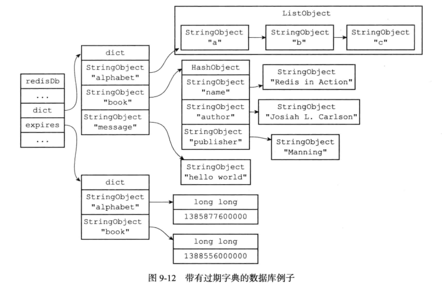
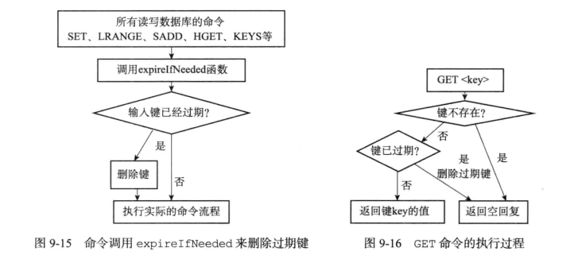
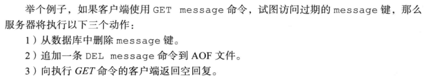
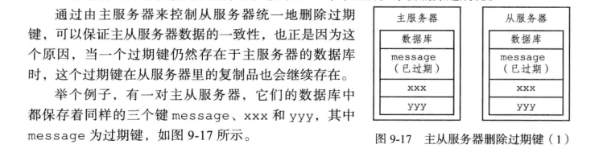

# 单机数据库实现和持久化

## 数据库细节实现

- 数据库的数据结构

  - ```c
    typedef struct redisDb {
        // 数据库键空间，保存着数据库中的所有键值对
        dict *dict;                 /* The keyspace for this DB */
        // 键的过期时间，字典的键为键，字典的值为过期事件 UNIX 时间戳
        dict *expires;              /* Timeout of keys with a timeout set */
        // 正处于阻塞状态的键
        dict *blocking_keys;        /* Keys with clients waiting for data (BLPOP)*/
        // 可以解除阻塞的键
        dict *ready_keys;           /* Blocked keys that received a PUSH */
        // 正在被 WATCH 命令监视的键
        dict *watched_keys;         /* WATCHED keys for MULTI/EXEC CAS */
        //数据库编码
        int id;                     /* Database ID */
        // 数据库的键的平均 TTL ，统计信息
        long long avg_ttl;          /* Average TTL, just for stats */
        //过期指针
        unsigned long expires_cursor; /* Cursor of the active expire cycle. */
        //即将整理的键名称,用一个list保存
        list *defrag_later;         /* List of key names to attempt to defrag one by one, gradually. */
    } redisDb;
    ```


- Hash table type implementation
  - tryResizeHashTables()用于缩小字典体积：如果字典的使用率比 HASHTABLE_MIN_MINFILL 常量要低，那么通过缩小字典的体积来节约内存,htNeedsResize()就是比较这两个大小的函数,在有孩子进程的时候不会进行resize
  - 服务器在对数据库执行增删改查命令时会对数据库进行渐进式 rehash ,但如果服务器长期没有执行命令的话，数据库字典的 rehash 就可能一直没办法完成,为了防止出现这种情况，incrementallyRehash()主动 rehash ,执行了rehash之后返回1,否则返回0

### 过期功能实现

- 设置生存和过期时间

  

- 带有生存和过期时间的数据库

  

  添加过期时间就是在过期字典中添加项目,移除过期时间就是在过期字典中删除对应的项目,键过期时间和当前时间做差就可以计算出生存时间.

- 过期键删除:

  - 惰性删除

    - db.c的expireIfNeeded()函数对于所有的输入键检查是否过期,过期的键直接删除

      

      - 定期删除
        - 由expire.c中的activeExpireCycle()函数实现定期删除,当服务器定期执行server.c的serverCron()函数时,就会调用,在expire字典中随机检查一部分键的过期时间,并且删除其中的过期键.

    - RDB对于过期键处理

      - 生成时过期键不加入RDB文件中
      - 主服务器载入时检查键是否过期,过期键不加入数据库;从服务器不检查,但是会和主服务器同步数据,同步的时候也会清除过期键

    - AOF对于过期键处理

      - 写入时如果键过期但没有删除,不会影响,当(惰性或者定期)删除的时候追加一条DEL
        - 

      - 重写入的时候检查键是否过期,过期键不加入数据库

    - 复制对于过期键处理

      - 主服务器处理,之后对从服务器发送DEL,从服务器对于过期键不做处理
      - 


    ### 数据库通知
    
    - 可以监视对键的操作情况,或者是监视某个指令的使用情况
    
    - 由notify.c/notifyKeyspaceEvent()函数实现:
    
      ```c
      /* The API provided to the rest of the Redis core is a simple function:
       *实现了发送数据库通知的功能
       * notifyKeyspaceEvent(int type, char *event, robj *key, int dbid);
       *
       * 'type' is the notification class we define in `server.h`.
       * type是当前想要发送的通知的类型,根据这个判断通知发送与否,提前在server.h中定义过种类
       * 'event' is a C string representing the event name.
       *  event 参数是一个字符串表示的事件名
       * 'key' is a Redis object representing the key name.
       * key 参数是一个 Redis 对象表示的键名,是产生事件的键
       * 'dbid' is the database ID where the key lives.
       * dbid 参数为键所在(产生事件)的数据库  
       * 每当一个redis命令需要发送数据库通知的时候,都会调用此函数,向函数传递命令的相关信息*/
      void notifyKeyspaceEvent(int type, char *event, robj *key, int dbid) {
          sds chan;
          robj *chanobj, *eventobj;
          int len = -1;
          char buf[24];
      
          /* If any modules are interested in events, notify the module system now.
           * This bypasses the notifications configuration, but the module engine
           * will only call event subscribers if the event type matches the types
           * they are interested in. */
           moduleNotifyKeyspaceEvent(type, event, key, dbid);
      
          /* If notifications for this class of events are off, return ASAP. 
          如果给定通知不是服务器允许发送的通知,直接返回*/
          if (!(server.notify_keyspace_events & type)) return;
      
          eventobj = createStringObject(event,strlen(event));
      
          /* __keyspace@<db>__:<key> <event> notifications. */
          //发送键空间通知
          if (server.notify_keyspace_events & NOTIFY_KEYSPACE) {
              chan = sdsnewlen("__keyspace@",11);
              len = ll2string(buf,sizeof(buf),dbid);
              chan = sdscatlen(chan, buf, len);
              chan = sdscatlen(chan, "__:", 3);
              chan = sdscatsds(chan, key->ptr);
              chanobj = createObject(OBJ_STRING, chan);
              pubsubPublishMessage(chanobj, eventobj);//通过publish发送通知
              decrRefCount(chanobj);
          }
      
          /* __keyevent@<db>__:<event> <key> notifications. */
          //发送键时间通知
          if (server.notify_keyspace_events & NOTIFY_KEYEVENT) {
              chan = sdsnewlen("__keyevent@",11);
              //初始化为-1,加入前面发送键空间通知的时候计算过了就不会是-1,少计算一次
              if (len == -1) len = ll2string(buf,sizeof(buf),dbid);
              chan = sdscatlen(chan, buf, len);
              chan = sdscatlen(chan, "__:", 3);
              chan = sdscatsds(chan, eventobj->ptr);
              chanobj = createObject(OBJ_STRING, chan);
              pubsubPublishMessage(chanobj, key);
              decrRefCount(chanobj);
          }
          decrRefCount(eventobj);
      }
      ```


​    

    ## RDB持久化
    
    redis是内存数据库,RDB持久化将数据库状态保存到磁盘里面,避免数据意外丢失
    
    RDB文件时压缩的二进制文件,可以用这个文件恢复数据库状态,主要使用save和bgsave实现
    
    ### 创建和载入
    
    - save创建RDB文件,但是会阻塞服务器;bgsave生成一个子进程,专门负责生成RDB文件
    - 只要有RDB文件在,就会自动载入RDB文件(如果开启了AOF持久化功能,会优先使用AOF文件还原数据库)
    - bgsave执行期间不能执行save,bgsave(防止竞争条件);也不能执行bgrewriteaof,因为都会有大量的磁盘写入
    
    ### 自动保存
    
    #### 设置自动保存条件
    
    设定自动保存的条件,达到条件时自动运行bgsave
    
    条件保存在redisServer的saveparams属性中
    
    #### dirty计数器和lastsave属性
    
    - dirty计数器记录上次成功执行save或者bgsave之后服务器对数据库进行修改的次数
    - lastsave记录了上次成功save的时间
    
    #### 检查保存条件
    
    serverCron函数默认没100ms就要执行一次,维护当前运行的数据库,同时也检查了自动保存条件是否满足,只要有一个条件满足了就要执行bgsave
    
    ## AOF持久化(Append Only File)
    
    通过保存所有的写命令记录数据库状态
    
    写命令执行之后加到redisServer的aof_buf缓冲区末尾,在处理事件循环的时候决定是否将缓冲区的值写入到AOF文件
    
    数据还原的时候先创建不带网络连接的伪客户端,直接使用来自AOF文件中的命令,挨个执行,最终执行完毕就是数据库的状态
    
    ### AOF文件重写
    
    - 直接读取当前状态,对于每个键直接使用add指令读取最后的状态作为一个add添加进去.
    
    - 开始执行重写之后可能会继续执行指令,对于数据库进行修改,因此建立了AOF重写缓冲区,新指令同时同步到AOF缓冲区和AOF重写缓冲区
    - 完成重写之后直接覆盖原来的AOF文件
    
    ## 
