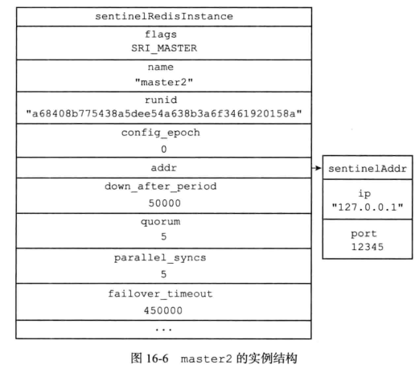
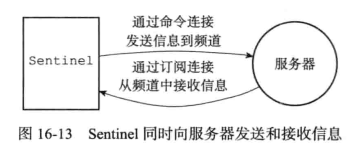
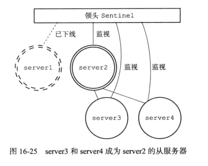

## 哨兵Sentinel

Sentinel节点本质上是一个特殊的Redis节点

它可以监视任意多个主服务器以及这些主服务器属下的所有从服务器，并在被监视的主服务器进人下线状态时(根据ping的时间间隔判断是否是下线了)， 自动将下线主服务器属下的某个从服务器升级为新的主服务器， 然后由新的主服务器代替已下线的主服务器继续处理命令请求  


当 serverl 的下线时长超过用户设定的下线时长上限时， Sentinel 系统就会对server1 执行故障转移操作：

- 首先， Sentinel 系统会挑选 server1属下的其中一个从服务器， 并将这个被选中的从服务器升级为新的主服务器。  
- 之后， Sentinel 系统会向 serverl 属下的所有从服务器发送新的复制指令， 让它们成为新的主服务器的从服务器， 当所有从服务器都开始复制新的主服务器时， 故障转移操作执行完毕。
- 另外， Sentinel 还会继续监视已下线的 serverl， 并在它重新上线时， 将它设置为新的主服务器的从服务器。  


### 网络连接

每个Sentinel实例会维护与所监测的主从实例之间的两个连接，分别是命令连接（Command Connection）和发布/订阅连接（Pub/Sub Connection）。但是**Sentinel和其他Sentinel之间只有一个命令连接**。

#### 命令连接

Sentinel维护命令连接是为了与其他主从实例以及Sentinel实例通过发送接收命令的方式进行通信

作用包括：

1. Sentinel会默认以每1s间隔发送PING 命令给其他实例以主观判断其他实例是否下线。
2. Sentinel会通过Sentinel和主实例之间的命令连接每隔10s发送INFO命令给主从实例以得到主实例和从实例的最新信息。
3. 在主实例下线的情况下，Sentinel会通过Sentinel和从实例的命令连接发送SLAVEOF NO ONE命令给选定的从实例从而使从实例提升为新的主节点。
4. Sentinel会默认每隔1s发送is-master-down-by-addr命令以询问其他Sentinel节点关于监控的主节点是否下线。

实现函数sentinel.c/sentinelReconnectInstance

#### 发布/订阅连接

Sentinel维护和其他主从节点的发布/订阅连接作用是为了获知其他监控相同主从实例的Sentinel实例的存在，并且从其他Sentinel实例中更新对所监控的主从实例以及发送的Sentinel实例的认知。例如在故障转移完成后，其他Sentinel通过读取领头Sentinel的频道消息来更新新的主节点的相关信息（地址，端口号等）。

Sentinel在默认每隔2秒钟会发送Hello消息包到其对应的主从实例的\__sentinel__:hello频道中。Hello消息格式如下：

```bash
__sentinel__:hello <sentinel地址> <sentinel端口号> <sentinel运行id> <sentinel配置纪元> <主节点名字 > <主节点地址> <主节点端口号> <主节点配置纪元>
```

当Sentinel通过订阅连接收到其他Sentinel发送的的Hello包时，会更新对主从节点以及发送Sentinel的实例，如果收到自己发送的Hello包，则简单的丢弃不做任何处理。

处理hello信息实现函数sentinel.c/sentinelProcessHelloMessage

发布/订阅连接实现函数sentinel.c/sentinelReconnectInstance

### 初始化

sentinel本质是一个特殊模式的redis的服务器，代码的入口一样位于server.c/main函数

与普通的节点有不同:

**sertinet.c/initSentinelConfig()**函数将会覆盖普通redis服务器的一些默认配置

```c
/**
 * 此函数用于设置Sentinel的默认值
 * 覆盖普通redis config默认值。
 */ 
/* This function overwrites a few normal Redis config default with Sentinel
 * specific defaults. */
void initSentinelConfig(void) {
    //使用26379作为sentinel的默认端口
    server.port = REDIS_SENTINEL_PORT; 
    server.protected_mode = 0; /* Sentinel must be exposed. */
}
```


使用**sentinel.c/sentinelcmds**作为sentinel的命令表

```c
//sentinel 模块初始化
/* Perform the Sentinel mode initialization. */
void initSentinel(void) {
    unsigned int j;
 
    // 清空常用命令；只添加sentinel 命令
    /* Remove usual Redis commands from the command table, then just add
     * the SENTINEL command. */
    dictEmpty(server.commands,NULL);
    for (j = 0; j < sizeof(sentinelcmds)/sizeof(sentinelcmds[0]); j++) {
        int retval;
        struct redisCommand *cmd = sentinelcmds+j;
 
        retval = dictAdd(server.commands, sdsnew(cmd->name), cmd);
        serverAssert(retval == DICT_OK);
    }
 
    //......
    //初始化各种数据结构
    //......
}
 
 
//所有sentinel可以执行的命令
struct redisCommand sentinelcmds[] = {
    {"ping",pingCommand,1,"fast @connection"},
    {"sentinel",sentinelCommand,-2,"admin"},
    {"subscribe",subscribeCommand,-2,"pub-sub"},
    {"unsubscribe",unsubscribeCommand,-1,"pub-sub"},
    {"psubscribe",psubscribeCommand,-2,"pub-sub"},
    {"punsubscribe",punsubscribeCommand,-1,"pub-sub"},
    {"publish",sentinelPublishCommand,3,"pub-sub fast"},
    {"info",sentinelInfoCommand,-1,"random @dangerous"},
    {"role",sentinelRoleCommand,1,"fast read-only @dangerous"},
    {"client",clientCommand,-2,"admin random @connection"},
    {"shutdown",shutdownCommand,-1,"admin"},
    {"auth",authCommand,-2,"no-auth fast @connection"},
    {"hello",helloCommand,-1,"no-auth fast @connection"},
    {"acl",aclCommand,-2,"admin"},
    {"command",commandCommand,-1, "random @connection"}
};
```


初始化sentinel状态

接下来服务器会初始化一个**sentinel.c/sentinelState**，用于保存所有与sentinel功能有关的状态(redisServer保存了一般的状态)

```c
 
/**
 * sentinel 状态 
*/
/* Main state. */
struct sentinelState {
    char myid[CONFIG_RUN_ID_SIZE+1]; /* This sentinel ID. */
    uint64_t current_epoch;         /* Current epoch. */ //当前纪元用户实现故障转移
 
    /**
     * 当前哨兵监听的所有master字典
     * key是实例名，value是指向sentinelRedisInstance 结构的指针
     */ 
    dict *masters;      /* Dictionary of master sentinelRedisInstances.
                           Key is the instance name, value is the
                           sentinelRedisInstance structure pointer. */
    //是否进入了TILT模式                                          
    int tilt;           /* Are we in TILT mode? */
    //目前正在执行的脚本数量
    int running_scripts;    /* Number of scripts in execution right now. */
    //进入tilt模式的时间
    mstime_t tilt_start_time;       /* When TITL started. */
    //最后一次执行处理器的时间
    mstime_t previous_time;         /* Last time we ran the time handler. */
    //FIFO队列，包含所有需要执行的用户脚本
    list *scripts_queue;            /* Queue of user scripts to execute. */
    char *announce_ip;  /* IP addr that is gossiped to other sentinels if
                           not NULL. */
    int announce_port;  /* Port that is gossiped to other sentinels if
                           non zero. */
    unsigned long simfailure_flags; /* Failures simulation. */
    int deny_scripts_reconfig; /* Allow SENTINEL SET ... to change script
                                  paths at runtime? */
} sentinel;
 
 
 
//sentinel 模块初始化
/* Perform the Sentinel mode initialization. */
void initSentinel(void) {
    unsigned int j;
    //...............
    // 清空常用命令；只添加sentinel 命令
    //..............
 
    //初始化各种数据结构
    /* Initialize various data structures. */
    sentinel.current_epoch = 0;
    sentinel.masters = dictCreate(&instancesDictType,NULL);
    sentinel.tilt = 0;
    sentinel.tilt_start_time = 0;
    sentinel.previous_time = mstime();
    sentinel.running_scripts = 0;
    sentinel.scripts_queue = listCreate();
    sentinel.announce_ip = NULL;
    sentinel.announce_port = 0;
    sentinel.simfailure_flags = SENTINEL_SIMFAILURE_NONE;
    sentinel.deny_scripts_reconfig = SENTINEL_DEFAULT_DENY_SCRIPTS_RECONFIG;
    memset(sentinel.myid,0,sizeof(sentinel.myid));
}
```

初始化sentinel状态的master属性

sentinelState状态中的master属性记录所有被sentinel监视的所有相关信息；

- sentinelState.masters的结构是hash；
- 字典键的被监视主服务的名字；
- 字典值则是 sentinel.c/sentinelRedisInstance结构体；

根据sentinel启动时的指定的配置项或者配置文件来初始化

如果按照下图指定:


则最后的字典值为:





创建与主服务器的网络连接

sentinel会与被监控的master建立连接，sentinel将会成为master的客户端

sentinel会创建两个连接向master的异步网络连接：

- 一个是命令连接，用于向master发送命令并接受回复
- 一个是订阅连接，用于订阅master的`__sentinel__:hello`频道

> **为什么要有两个连接**
>
> 目前发布和订阅的功能，被发送的信息都不会保存在服务器里面；
>
> 如果发送时接受信息的客户端不在线，那么客户端就会丢失这条数据；为了不丢失`__sentinel__:hello`频道的任何信息，所以sentinel必须创建一个订阅连接来接受消息
>
> 因为是多个连接,所以必须是异步的
>
> **创建入口：**
> server.c/main -> server.c/serverCron() -> sentinel.c/sentinelTimer -> sentinel.c/sentinelHandleDictOfRedisInstances() -> sentinel.c/sentinelHandleRedisInstance

```c
//对于特定的redis实例执行预操作
/* Perform scheduled operations for the specified Redis instance. */
void sentinelHandleRedisInstance(sentinelRedisInstance *ri) {
    /* ========== MONITORING HALF ============ */
    /* Every kind of instance */
    //监控所有类型的实例(master,slave,sentinel)
    sentinelReconnectInstance(ri);
    sentinelSendPeriodicCommands(ri);

    /* ============== ACTING HALF ============= */
    /* We don't proceed with the acting half if we are in TILT mode.
     * TILT happens when we find something odd with the time, like a
     * sudden change in the clock. */
    //对于tilt模式下哨兵已经不可信,这时候检测是否时钟恢复正常,如果正常就推出tilt模式
    if (sentinel.tilt) {
        if (mstime()-sentinel.tilt_start_time < sentinel_tilt_period) return;
        sentinel.tilt = 0;
        sentinelEvent(LL_WARNING,"-tilt",NULL,"#tilt mode exited");
    }

    /* Every kind of instance */
    sentinelCheckSubjectivelyDown(ri);

    /* Masters and slaves */
    if (ri->flags & (SRI_MASTER|SRI_SLAVE)) {
        /* Nothing so far. */
    }

    /* Only masters */
    if (ri->flags & SRI_MASTER) {
        sentinelCheckObjectivelyDown(ri);
        if (sentinelStartFailoverIfNeeded(ri))
            sentinelAskMasterStateToOtherSentinels(ri,SENTINEL_ASK_FORCED);
        sentinelFailoverStateMachine(ri);
        sentinelAskMasterStateToOtherSentinels(ri,SENTINEL_NO_FLAGS);
    }
}
```


### 获取主服务器信息

sentinel默认每10s一次频率向 master & slale发送info命令

实现的入口:(server.c/main -> server.c/serverCron() -> sentinel.c/sentinelTimer -> sentinel.c/sentinelHandleDictOfRedisInstances() -> sentinel.c/sentinelSendPeriodicCommands)

```c
/**
 * 定期向指定的slave或master发送PING、INFO, 发布到消息到 “订阅”的channel
 */
//类似于心跳检测
/* Send periodic PING, INFO, and PUBLISH to the Hello channel to
 * the specified master or slave instance. */
void sentinelSendPeriodicCommands(sentinelRedisInstance *ri) {
    mstime_t now = mstime();
    mstime_t info_period, ping_period;
    int retval;

    /* Return ASAP if we have already a PING or INFO already pending, or
     * in the case the instance is not properly connected. */
    if (ri->link->disconnected) return;

    /* For INFO, PING, PUBLISH that are not critical commands to send we
     * also have a limit of SENTINEL_MAX_PENDING_COMMANDS. We don't
     * want to use a lot of memory just because a link is not working
     * properly (note that anyway there is a redundant protection about this,
     * that is, the link will be disconnected and reconnected if a long
     * timeout condition is detected. */
    if (ri->link->pending_commands >=
        SENTINEL_MAX_PENDING_COMMANDS * ri->link->refcount) return;

    /* If this is a slave of a master in O_DOWN condition we start sending
     * it INFO every second, instead of the usual SENTINEL_INFO_PERIOD
     * period. In this state we want to closely monitor slaves in case they
     * are turned into masters by another Sentinel, or by the sysadmin.
     *
     * Similarly we monitor the INFO output more often if the slave reports
     * to be disconnected from the master, so that we can have a fresh
     * disconnection time figure. */
    //对于一个处于客观判断下线的slave,每秒发送info,避免被转换成了master
    //同时也检测其真实下线时间
    //todo:这里其实消耗的资源会比较多,有没有更好的解决办法
    if ((ri->flags & SRI_SLAVE) &&
        ((ri->master->flags & (SRI_O_DOWN|SRI_FAILOVER_IN_PROGRESS)) ||
         (ri->master_link_down_time != 0)))
    {
        info_period = 1000;
    } else {
        info_period = sentinel_info_period;
    }

    /* We ping instances every time the last received pong is older than
     * the configured 'down-after-milliseconds' time, but every second
     * anyway if 'down-after-milliseconds' is greater than 1 second. */
    ping_period = ri->down_after_period;
    if (ping_period > sentinel_ping_period) ping_period = sentinel_ping_period;

    /* Send INFO to masters and slaves, not sentinels. */
    //向master和slave发送info命令
    if ((ri->flags & SRI_SENTINEL) == 0 &&
        (ri->info_refresh == 0 ||
        (now - ri->info_refresh) > info_period))
    {
        retval = redisAsyncCommand(ri->link->cc,
            sentinelInfoReplyCallback, ri, "%s",
            sentinelInstanceMapCommand(ri,"INFO"));
        if (retval == C_OK) ri->link->pending_commands++;
    }

    /* Send PING to all the three kinds of instances. */
    //对所有的实例发送ping
    if ((now - ri->link->last_pong_time) > ping_period &&
               (now - ri->link->last_ping_time) > ping_period/2) {
        sentinelSendPing(ri);
    }

    /* PUBLISH hello messages to all the three kinds of instances. */
    //向订阅的频道发布信息
    if ((now - ri->last_pub_time) > sentinel_publish_period) {
        sentinelSendHello(ri);
    }
}
```


通过解析maser返回Info命令信息，获取master的当前信息；

- 一方面获取master的信息，包括run_id、角色、地址等；
- 另一方面获取master下所有slave服务器信息；

根据这些返回信息，用户无需提供从服务器信息，就可以自动发现从服务器（便于与从服务器建立连接）

这些信息用来更新slaves字典,出现了新的就要加入到字典中,键是从服务器的ip:port，值是从服务器的对应实例结构


**解析info返回结果入口**
**sentinel.c/sentinelSendPeriodicCommands** -> **sentinel.c/sentinelInfoReplyCallback** > **sentinel.c/sentinelInfoReplyCallback** > **sentinel.c/sentinelRefreshInstanceInfo**

### 获取从服务器信息

对于每个连接到主服务器的从服务器也要建立命令连接和订阅连接


通过解析slave返回的slave的信息，主要提取以下信息。然后根据这些信息，更新从服务的实例信息；

- 从服务的run_id
- 主服务器的ip地址以及端口号
- 主从服务器的连接状态
- 从服务器优先级
- 从服务的偏移量


### 向被监视的主从服务器发送信息

每两秒进行一次

发送的内容：

- sentinel_ip :sentinel的ip；
- sentinel_port：sentinel的端口
- sentinel_runid：：sentinel的runid
- sentinel_current_epoch:sentinel当前配置的纪元
- master_name: master的名称
- ·master_ip：master的ip
- master_port：master的端口
- master_config_epoch：master的当前配置的纪元

函数实现：（sentinel.c/sentinelSendHello）

```c
//通过Pub/Sub向指定的redis实例(即ri)发送hello消息,广播主机当前的配置,通知sentinel存活
//如果发布成功排队,返回C_OK,否则是C_ERR
int sentinelSendHello(sentinelRedisInstance *ri) {
    char ip[NET_IP_STR_LEN];
    char payload[NET_IP_STR_LEN+1024];
    int retval;
    char *announce_ip;
    int announce_port;
    sentinelRedisInstance *master = (ri->flags & SRI_MASTER) ? ri : ri->master;
    sentinelAddr *master_addr = sentinelGetCurrentMasterAddress(master);

    if (ri->link->disconnected) return C_ERR;

    /* Use the specified announce address if specified, otherwise try to
     * obtain our own IP address. */
    //设置广播的ip和端口
    if (sentinel.announce_ip) {
        announce_ip = sentinel.announce_ip;
    } else {
        if (anetFdToString(ri->link->cc->c.fd,ip,sizeof(ip),NULL,FD_TO_SOCK_NAME) == -1)
            return C_ERR;
        announce_ip = ip;
    }
    if (sentinel.announce_port) announce_port = sentinel.announce_port;
    else if (server.tls_replication && server.tls_port) announce_port = server.tls_port;
    else announce_port = server.port;

    /* Format and send the Hello message. */
    //格式化要发送的消息
    snprintf(payload,sizeof(payload),
        "%s,%d,%s,%llu," /* Info about this sentinel. */
        "%s,%s,%d,%llu", /* Info about current master. */
        announce_ip, announce_port, sentinel.myid,
        (unsigned long long) sentinel.current_epoch,
        /* --- */
        master->name,announceSentinelAddr(master_addr),master_addr->port,
        (unsigned long long) master->config_epoch);
    retval = redisAsyncCommand(ri->link->cc,
        sentinelPublishReplyCallback, ri, "%s %s %s",
        sentinelInstanceMapCommand(ri,"PUBLISH"),
        SENTINEL_HELLO_CHANNEL,payload);
    if (retval != C_OK) return C_ERR;
    ri->link->pending_commands++;
    return C_OK;
}
```


### 接受来自主从服务器的频道信息

当sentinel与主服务或者从服务建立连接后，sentinel就订阅主服务或从服务器的`__sentinel__::hello`频道；

订阅频道会一直持续到连接断开；



这样对于监听同一个服务器的多个sentinel，一个sentinel发送的信息会被其他sentinel接受到，这些信息会被其他sentinel用于更新信息；

**举个例子：**
假设有三个sentinel ，s1、s2、s3监听同一个服务器，s1向服务器频道`__sentinel__:hello`发送了一条信息，s1、s2、s3都会受到这条消息 ；


sentinel接受到消息后，会对消息进行解析:

- 如果是自己发送的信息，就会丢弃该信息
- 如不是自己发送的，则是监视同一服务器的其他sentinel发送的，则会更新sentinel实例中相关信息


### 更新sentinels字典

每个sentinel节点对于其他也监视这个主服务器的其他sentinel节点保存了一个instance结构

- 键是其中一个 Sentinel 的名字， 格式为 ip:port
- 值是对应的实例结构

收到其他sentinel发送的消息时，对于信息中sentinel，主服务器相关的参数配置做相应的记录


sentinel节点保存的master实例中的sentinels字典不需要包含自身

sentinels字典利于发现监视同一个主服务器的其他sentinel节点

### 创建连向其他sentinel节点的命令连接

使用命令连接相连的各个 Sentinel 可以通过向其他 Sentinel 发送命令请求来进行信息交换，但是不会创建订阅链接

Sentinel需要通过接收主服务器或者从服务器发来的频道信息来发现未知的新 Sentinel, 所以需要建立订阅连接， 而相互已知的 Sentinel 只要使用命令连接来进行通信就足够了   


### 检测主观下线状态

默认情况下sentinel每秒发送ping，然后通过回复的pong确认监视的对象是否下线

对于ping命令的回复分两种情况：

- 有效回复：返回 +PONG、-LOADING、-MASTERDOWN
- 无效回复：除了上述三种的回复外，都是无效回复

如果down-after-millseconds毫秒内，连续返回无效回复，那么sentinel就会将master标记为主观下线，在实例结构的flag属性中标记主观下线


> down-after-millonseconds是sentinel配置文件指定的下线标准；
> 这个参数不仅会应用于master，还会应用到master下属的所有从服务器；
>
> 多个sentinel设置的down-after-millseconds时间可能是不同的，所以可能部分的sentinel认为主观下线，而其他的认为没有主观下线

#### 检测客观下线状态

当sentinel将一个主服务器判断主观下线时，会向其他sentinel询问，看其他sentinel是否也人为他下线；

当有足够多的sentinel认为服务已经下线时，就判定服务器是客观下线，并进行故障转移

#### 发送SENTINEL is-master-down-by-addr命令

询问其他sentinel的命令

```bash
SENTINEL is-master-down-by-addr <ip> <port> <current_epoch> <runid>
```

各参数意义如下

- ip：被sentinel判断为主观下线的服务ip
- port：被sentinel判断为主观下线的服务端口
- current_epoch：sentinel当前配置的纪元，用于选取领头sentinel
- runid:可以是\*符号或者sentinel的运行id，\* 代表用于检测主服务器的客观下线状态；sentinel的运行id 则代表用于选举领头的sentinel；

#### 接受SENTINEL is-master-down-by-addr命令

返回的信息是包含三个参数的multi bulk：

- <down_state>：表示自己对于目标服务器在线状态的检测结果
- <leader_runid>：可以是 \* 符号或者目标 Sentinel 的局部领头 Sentinel 的运行 ID: \* 符号代表命令用于检测主服务器的下线状态， 而局部领头 Sentinel 的运行 ID 则用于选举领头 Sentinel
- <leader_epoch>  ：局部领头 Sentinel的运行纪元

#### 接受SENTINEL is-master-down-by-addr命令 的回复

sentienl根据SENTINEL is-master-down-by-addr命令的返回，统计其他sentinel返回下线的数量；
当这一数量达到配置指定的客观下线数量（之前由quorum参数指定）时，sentinel会将服务器实例结构的flags属性的SIR_O_DOWN标记位打开，标识主服务进入客观下线状态；


> 同样的，多个sentinel设置的quorum参数可能是不同的，所以可能部分的sentinel认为客观下线，而其他的认为没有客观下线

### 选举sentinel领头者

当一个主服务器被判断为下线时，监视这个服务器sentinel的会进行协商，选举出一个领头的sentinel，由这个领头的sentinel执行故障转移操作

**选举领头sentinel的规则和方法**：

- 所有在线的sentinel都有被选为领头sentinel的资格
- 每次进行领头sentinel选举的时候，不论选举是否成功，所有sentinel的配置纪元的值都会+1；（配置的纪元就是个计数器）
- 每个配置的纪元里面，所有sentinel都有一票将某个sentinel设置为局部领头sentinel的机会，并且局部领头一旦设置，在这个配置纪元里面就不能更改了
- 每个发现主服务器下线的sentinel，都会要求其他sentinel将自己设置为领头sentinel
- sentinel设置局部领头sentinel的选票规则是先到先得；最先向目标sentinel“索要投票” 将会得到该票，后续“索票”的sentinel将会被拒绝；
- 源sentinel收到目标sentinel的回复后，会解析回复中的leader_epoch；如果leader_epoch和源sentinel的一致，那么源sentinel会继续解析leader_runid参数；
  如果leader_runid和源sentinel的run_id一致，说明目标sentinel将源sentinel设为了领头sentinel；
- 如果某sentinel被半数以上sentinel设置为了领头sentinel，那么这个sentinel将会成为领头sentinel；
- 如果给定的时间限制内，没有选举出领头sentinel，那么将在一段时间后重新选举，直到选举出为止；

在这里和区块链选举比较相似

### 故障转移

选举出的领头sentinel将会已下线的主服务器进行下线操作，下线操作分为以下三个操作：

1. 在已下线的主服务的所有从服务器中，挑选出一个从服务器，将其转换为主服务器；
2. 将已下线的主服务的所有从服务器，复制新的主服务器；
3. 设置已经下线的主服务为从服务，并复制新的主服务，当下线的主服务重新上线后，就会复制新的主服务了；

#### 选取新的主服务器步骤

1. 领头的sentinel会将下线的主服务的所有从服务放到一个列表里，然后按照以下规则对列表中一个个的过滤：
2. 过滤掉已经断线的从服务器；
3. 过滤掉最近5s内没有回复过sentinel 的info命令的从服务；
4. 过滤掉与主服务器连接断开时间超过（down-after-millseconds * 10）毫秒的从服务器；这样可以保证剩余从服务器的数据比较新；
5. 然后从剩余从服务器中选举优先级高的从服务器；
6. 如果服务器优先级相同，则选取复制偏移量大的（复制偏移量大，说明数据新）；
7. 至此，如果还没有选举出，则对运行id进行排序，选举出运行id最小的从服务器；

选举出新的主服务后，sentinel将向新的主服务器发送slave no one ，转换成新的主服务器
然后领头sentinel以每秒一次的频率向新的主服务发送info命令,用于判断“切换主服务操作”是否成功（当新的主服务器角色由salve变成master，说明已经切换成功了）

#### 修改从服务器的复制目标

新的主服务出现后，sentinel就会让所有从服务器去复制新的主服务器（通过salveof 命令实现）




#### 修改旧的主服务器的为从服务器

最后，将已经下线的主服务设置为从服务器，并复制新的主服务；

注意：因为这时旧的主服务已经下线，所以这时这个操作先保存到sentinel对应的实例结构中，等到旧的主服务重新上线后，sentinel就会向他发送slaveof命令，将他设置为从服务器；

### tilt模式

Redis哨兵依赖于系统时间,为了了解某个实例是否是可用的,其会记住最后一次成功回复PING命令的时间,然后与现在时间进行比较判断生存时间.
但是如果计算机时间发生了意外的变化,或者计算机现在非常忙碌,或者进程因为某些原因阻塞,哨兵可能会有意料之外的行为

TILT是一个特殊的保护模式,Sentinel的Tilt模式会在以下两种情况下开启：

1. Sentinel进程被阻塞超过SENTINEL_TILT_TRIGGER时间（默认为2s），可能因为进程或系统I/O（内存，网络，存储）请求过多。
2. 系统时钟调整到之前某个时间值。

进入tilt模式会降低系统的可靠性(因为此时故障转移无法进行).sentinel计时器中断一般一秒十次.我们希望两次定时器中断的时间内控制在大约100毫秒.

当进入TILT模式时哨兵将会继续监视所有内容,但是

- 停止所有的动作
- 会开始否定`SENTINEL is-master-down-by-addr`命令因为其不信任故障检测的能力

如果30秒以内一切正常则退出TILT模式.
注意可以使用很多内核提供的单调时钟API已替换TILT模式.但是尚不清楚这是否是一个好的解决方案,因为当前系统避免了如果进程只是被挂起或长时间未由调度程序执行这种问题.

在计算机时间发生严重变化的时候进入`TILT模式`,并禁止除了监控以外的操作,因为此时sentinel依赖于时间,判断某个节点下线是根据PING的间隔来实现的,如果进入`TILT模式`证明时钟出现问题,此时这个sentinel已经不能被相信了.

