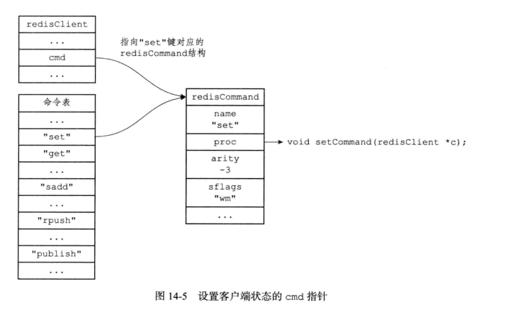
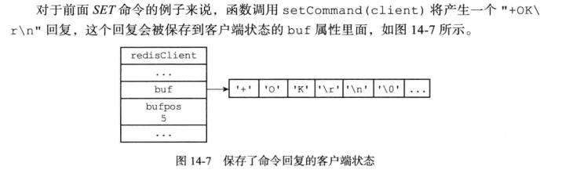
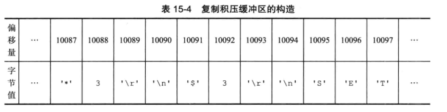
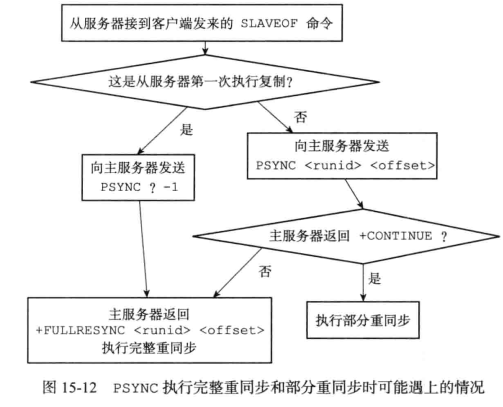
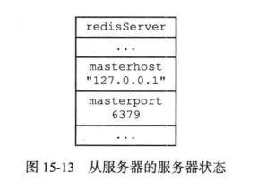
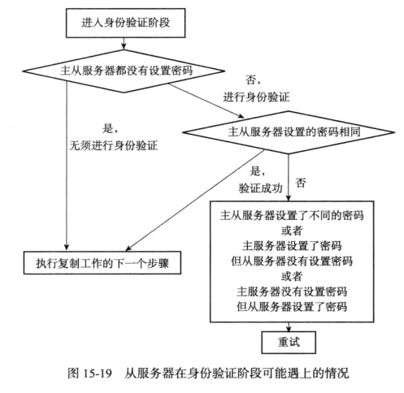
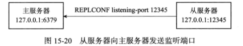

# redis客户端与服务器

## 客户端

- cli命令行

  ```c
  typedef struct multiCmd {
      //参数
      robj **argv;
      //参数数量
      int argc;
      //命令指针
      struct redisCommand *cmd;
  } multiCmd;
  ```

- client结构(直接对于所有的数据结构进行了解释)

  ```c
  //I/O复用,所以需要为每个客户端维持一个状态,多个客户端在服务器用链表链接
  typedef struct client {
      //client的id
      uint64_t id;            /* Client incremental unique ID. */
      connection *conn;
      //协议版本
      int resp;               /* RESP protocol version. Can be 2 or 3. */
      //当前正在使用的数据库
      redisDb *db;            /* Pointer to currently SELECTed DB. */
      //客户端名字
      robj *name;             /* As set by CLIENT SETNAME. */
      //缓冲区,用于储存指令
      sds querybuf;           /* Buffer we use to accumulate client queries. */
      //在指令缓冲区中已经读到的位置
      size_t qb_pos;          /* The position we have read in querybuf. */
      sds pending_querybuf;   /* If this client is flagged as master, this buffer
                                 represents the yet not applied portion of the
                                 replication stream that we are receiving from
                                 the master. */
      //最近时间内缓冲区长度最大值
      size_t querybuf_peak;   /* Recent (100ms or more) peak of querybuf size. */
      //当前指令的参数数量
      int argc;               /* Num of arguments of current command. */
      //当前指令参数值
      robj **argv;            /* Arguments of current command. */
      //参数有可能是重写过的,记录了原来的参数数量
      int original_argc;      /* Num of arguments of original command if arguments were rewritten. */
      //参数有可能是重写过的,记录了原来的参数值
      robj **original_argv;   /* Arguments of original command if arguments were rewritten. */
      size_t argv_len_sum;    /* Sum of lengths of objects in argv list. */
      //记录客户端执行的命令
      struct redisCommand *cmd, *lastcmd;  /* Last command executed. */
      //与之前定义的user对应,从而赋予相应的权限,NULL是管理员
      user *user;             /* User associated with this connection. If the
                                 user is set to NULL the connection can do
                                 anything (admin). */
      //指令类型,一条指令还是多条(内联)
      int reqtype;            /* Request protocol type: PROTO_REQ_* */
      //还未读取的指令数量
      int multibulklen;       /* Number of multi bulk arguments left to read. */
      //未读指令的
      long bulklen;           /* Length of bulk argument in multi bulk request. */
      //回复链表
      list *reply;            /* List of reply objects to send to the client. */
      //回复链表中对象的总大小
      unsigned long long reply_bytes; /* Tot bytes of objects in reply list. */
      // 已发送字节，用于处理 short write 
      size_t sentlen;         /* Amount of bytes already sent in the current
                                 buffer or object being sent. */
      //创建客户端时间
      time_t ctime;           /* Client creation time. */
      long duration;          /* Current command duration. Used for measuring latency of blocking/non-blocking cmds */
      // 客户端最后一次和服务器互动的时间
      time_t lastinteraction; /* Time of the last interaction, used for timeout */
      time_t obuf_soft_limit_reached_time;
      //客户端状态CLIENT_*
      uint64_t flags;         /* Client flags: CLIENT_* macros. */
      int authenticated;      /* Needed when the default user requires auth. */
      //复制状态
      int replstate;          /* Replication state if this is a slave. */
      int repl_put_online_on_ack; /* Install slave write handler on first ACK. */
      // 用于保存主服务器传来的 RDB 文件的文件描述符
      int repldbfd;           /* Replication DB file descriptor. */
      // 读取主服务器传来的 RDB 文件的偏移量
      off_t repldboff;        /* Replication DB file offset. */
      // 主服务器传来的 RDB 文件的大小
      off_t repldbsize;       /* Replication DB file size. */
      sds replpreamble;       /* Replication DB preamble. */
      long long read_reploff; /* Read replication offset if this is a master. */
      // 主服务器的复制偏移量
      long long reploff;      /* Applied replication offset if this is a master. */
      // 从服务器最后一次发送 REPLCONF ACK 时的偏移量
      long long repl_ack_off; /* Replication ack offset, if this is a slave. */
      // 从服务器最后一次发送 REPLCONF ACK 的时间
      long long repl_ack_time;/* Replication ack time, if this is a slave. */
      long long repl_last_partial_write; /* The last time the server did a partial write from the RDB child pipe to this replica  */
      long long psync_initial_offset; /* FULLRESYNC reply offset other slaves
                                         copying this slave output buffer
                                         should use. */
      // 主服务器的 master run ID
      // 保存在客户端，用于执行部分重同步
      char replid[CONFIG_RUN_ID_SIZE+1]; /* Master replication ID (if master). */
      // 从服务器的监听端口号
      int slave_listening_port; /* As configured with: REPLCONF listening-port */
      char *slave_addr;       /* Optionally given by REPLCONF ip-address */
      int slave_capa;         /* Slave capabilities: SLAVE_CAPA_* bitwise OR. */
      //事务状态
      multiState mstate;      /* MULTI/EXEC state */
      //阻塞类型
      int btype;              /* Type of blocking op if CLIENT_BLOCKED. */
      //阻塞状态
      blockingState bpop;     /* blocking state */
      // 最后被写入的全局复制偏移量
      long long woff;         /* Last write global replication offset. */
      list *watched_keys;     /* Keys WATCHED for MULTI/EXEC CAS */
      // 这个字典记录了客户端所有订阅的频道
      // 键为频道名字，值为 NULL
      // 也即是，一个频道的集合
      dict *pubsub_channels;  /* channels a client is interested in (SUBSCRIBE) */
      // 链表，包含多个 pubsubPattern 结构
      // 记录了所有订阅频道的客户端的信息
      // 新 pubsubPattern 结构总是被添加到表尾
      list *pubsub_patterns;  /* patterns a client is interested in (SUBSCRIBE) */
      sds peerid;             /* Cached peer ID. */
      sds sockname;           /* Cached connection target address. */
      listNode *client_list_node; /* list node in client list */
      listNode *paused_list_node; /* list node within the pause list */
      RedisModuleUserChangedFunc auth_callback; /* Module callback to execute
                                                 * when the authenticated user
                                                 * changes. */
      void *auth_callback_privdata; /* Private data that is passed when the auth
                                     * changed callback is executed. Opaque for
                                     * Redis Core. */
      void *auth_module;      /* The module that owns the callback, which is used
                               * to disconnect the client if the module is
                               * unloaded for cleanup. Opaque for Redis Core.*/
  
      /* If this client is in tracking mode and this field is non zero,
       * invalidation messages for keys fetched by this client will be send to
       * the specified client ID. */
      uint64_t client_tracking_redirection;
      rax *client_tracking_prefixes; /* A dictionary of prefixes we are already
                                        subscribed to in BCAST mode, in the
                                        context of client side caching. */
      /* In clientsCronTrackClientsMemUsage() we track the memory usage of
       * each client and add it to the sum of all the clients of a given type,
       * however we need to remember what was the old contribution of each
       * client, and in which category the client was, in order to remove it
       * before adding it the new value. */
      uint64_t client_cron_last_memory_usage;
      int      client_cron_last_memory_type;
      /* Response buffer */
      // 回复偏移量
      int bufpos;
      size_t buf_usable_size; /* Usable size of buffer. */
      /* Note that 'buf' must be the last field of client struct, because memory
       * allocator may give us more memory than our apply for reducing fragments,
       * but we want to make full use of given memory, i.e. we may access the
       * memory after 'buf'. To avoid make others fields corrupt, 'buf' must be
       * the last one. */
      //回复缓冲区
      char buf[PROTO_REPLY_CHUNK_BYTES];
  } client;
  ```

  所有的client属性连成了一个链表,保存在redisServer的clients属性中,对于不同状态的client也有其他的链表保存.

  ```c
  struct redisServer {
  	//...
  	//链表,保存了所有的客户端状态
      list *clients;              /* List of active clients */
      //保存所有的待关闭客户端
      list *clients_to_close;     /* Clients to close asynchronously */
      //将要写的客户端列表
      list *clients_pending_write; /* There is to write or install handler. */
      //将要读的客户端列表(已经知道有指令输入了)
      list *clients_pending_read;  /* Client has pending read socket buffers. */
      //...
  };
  ```

### 客户端属性

包含通用属性(所有客户端执行基础功能都必须需要的)和特定功能(执行特定功能)相关的属性

- 套接字描述符uint64_t id;

  - 伪客户端:id为-1,载入AOF文件时使用,或者是执行Lua脚本中包含的redis命令
  - 普通客户端的id大于-1,表示是正常的客户端

- 名字robj *name;

  - 可有可无,一个robj对象,没有的时候指定为NULL

- 标志uint64_t flags;

  - 表示了当前客户端的角色和状态

  - 可以是单个也可以是多个标志的二进制取或.见CLIENT_*的定义可知,都是一位表示的

  - ```c#
    /* Client flags */
    //主从服务器进行复制时,相互都是客户端的关系,slave和master区分两个服务器
    #define CLIENT_SLAVE (1<<0)   /* This client is a replica */
    #define CLIENT_MASTER (1<<1)  /* This client is a master */
    //正在执行monitor指令,是一个从客户端
    #define CLIENT_MONITOR (1<<2) /* This client is a slave monitor, see MONITOR */
    //执行事务
    #define CLIENT_MULTI (1<<3)   /* This client is in a MULTI context */
    //客户端被阻塞
    #define CLIENT_BLOCKED (1<<4) /* The client is waiting in a blocking operation */
    //事务使用WATCH监视的数据库键已经被修改,EXEC执行过程中会直接fail
    #define CLIENT_DIRTY_CAS (1<<5)
    //用户对这个客户端执行了 CLIENT KILL命令或者客户端发送给服务器的命令中协议内容有误, 
    //服务器会将客户端积存在输出缓冲区中的所有内容发送给客户端,然后关闭客户端
    #define CLIENT_CLOSE_AFTER_REPLY (1<<6) /* Close after writing entire reply. */
    //从阻塞中解除,只有在之前阻塞过才可用
    #define CLIENT_UNBLOCKED (1<<7) /* This client was unblocked and is stored in
                                      server.unblocked_clients */
    //专门处理Lua脚本的客户端
    #define CLIENT_LUA (1<<8) /* This is a non connected client used by Lua */
    //客户端向集群节点（ 运行在集群模式下的服务器） 发送了ASKING 命令
    #define CLIENT_ASKING (1<<9)     /* Client issued the ASKING command */
    //客户端的输出缓冲区大小超出了服务器允许的范围，
    //服务器会在下一次执行 serverCron 函数时关闭这个客户端,以免影响服务器的稳定性
    //积存在输出缓冲区中的所有内容会直接被释放,不会返回给客户端.
    #define CLIENT_CLOSE_ASAP (1<<10)/* Close this client ASAP */
    //服务器使用 UNIX 套接字来连接客户端
    #define CLIENT_UNIX_SOCKET (1<<11) /* Client connected via Unix domain socket */
    //事务在命令入队时出现了错误, 和CLIENT_DIRTY_CAS 都表示了事务不安全,EXEC会执行失败
    #define CLIENT_DIRTY_EXEC (1<<12)  /* EXEC will fail for errors while queueing */
    //在主从服务器进行命令传播期间,从服务器需要向主服务器发送REPLICATION ACK命令
    //发送命令之前需要打开这个标志以允许发送操作执行
    #define CLIENT_MASTER_FORCE_REPLY (1<<13)  /* Queue replies even if is master */
    //执行PUBSUB指令时打开,强制服务器将当前执行的命令写人到 AOF 文件里面
    #define CLIENT_FORCE_AOF (1<<14)   /* Force AOF propagation of current cmd. */
    //执行SCRIPT LOADD指令时打开,强制主服务器将当前执行的命令复制给所有从服务器
    #define CLIENT_FORCE_REPL (1<<15)  /* Force replication of current cmd. */
    //主服务器不能使用PSYNC命令与当前低版本从服务器进行同步.
    //这个标志只能在 REDIS_SLAVE 标志处于打开状态时使用
    #define CLIENT_PRE_PSYNC (1<<16)   /* Instance don't understand PSYNC. */
    #define CLIENT_READONLY (1<<17)    /* Cluster client is in read-only state. */
    #define CLIENT_PUBSUB (1<<18)      /* Client is in Pub/Sub mode. */
    #define CLIENT_PREVENT_AOF_PROP (1<<19)  /* Don't propagate to AOF. */
    #define CLIENT_PREVENT_REPL_PROP (1<<20)  /* Don't propagate to slaves. */
    #define CLIENT_PREVENT_PROP (CLIENT_PREVENT_AOF_PROP|CLIENT_PREVENT_REPL_PROP)
    #define CLIENT_PENDING_WRITE (1<<21) /* Client has output to send but a write
                                            handler is yet not installed. */
    #define CLIENT_REPLY_OFF (1<<22)   /* Don't send replies to client. */
    #define CLIENT_REPLY_SKIP_NEXT (1<<23)  /* Set CLIENT_REPLY_SKIP for next cmd */
    #define CLIENT_REPLY_SKIP (1<<24)  /* Don't send just this reply. */
    #define CLIENT_LUA_DEBUG (1<<25)  /* Run EVAL in debug mode. */
    #define CLIENT_LUA_DEBUG_SYNC (1<<26)  /* EVAL debugging without fork() */
    #define CLIENT_MODULE (1<<27) /* Non connected client used by some module. */
    #define CLIENT_PROTECTED (1<<28) /* Client should not be freed for now. */
    #define CLIENT_PENDING_READ (1<<29) /* The client has pending reads and was put
                                           in the list of clients we can read
                                           from. */
    #define CLIENT_PENDING_COMMAND (1<<30) /* Indicates the client has a fully
                                            * parsed command ready for execution. */
    #define CLIENT_TRACKING (1ULL<<31) /* Client enabled keys tracking in order to
                                       perform client side caching. */
    #define CLIENT_TRACKING_BROKEN_REDIR (1ULL<<32) /* Target client is invalid. */
    #define CLIENT_TRACKING_BCAST (1ULL<<33) /* Tracking in BCAST mode. */
    #define CLIENT_TRACKING_OPTIN (1ULL<<34)  /* Tracking in opt-in mode. */
    #define CLIENT_TRACKING_OPTOUT (1ULL<<35) /* Tracking in opt-out mode. */
    #define CLIENT_TRACKING_CACHING (1ULL<<36) /* CACHING yes/no was given,
                                                  depending on optin/optout mode. */
    #define CLIENT_TRACKING_NOLOOP (1ULL<<37) /* Don't send invalidation messages
                                                 about writes performed by myself.*/
    #define CLIENT_IN_TO_TABLE (1ULL<<38) /* This client is in the timeout table. */
    #define CLIENT_PROTOCOL_ERROR (1ULL<<39) /* Protocol error chatting with it. */
    #define CLIENT_CLOSE_AFTER_COMMAND (1ULL<<40) /* Close after executing commands
                                                   * and writing entire reply. */
    #define CLIENT_DENY_BLOCKING (1ULL<<41) /* Indicate that the client should not be blocked.
                                               currently, turned on inside MULTI, Lua, RM_Call,
                                               and AOF client */
    #define CLIENT_REPL_RDBONLY (1ULL<<42) /* This client is a replica that only wants RDB without replication buffer. */
    ```

    

  - PUBSUB命令:本身不修改数据库,但是向频道的所有订阅者发送消息的行为带有副作用， 接收到消息的所有客户端的状态都会因为这个命令而改变,所以也需要写入AOF.

  - SCRIPT LOAD命令:类似的,它修改了服务器状态,也带有副作用,同时因为涉及到主从服务器,CLIENT_FORCE_REPL将指令发给所有的从服务器.

- 输入缓冲区

  - ```c#
    typedef struct client {
    	//缓冲区,用于储存指令
        sds querybuf;           /* Buffer we use to accumulate client queries. */
    }client;
    ```

    

  - 保存用户发送的命令请求,根据输入内容动态变化大小

- 命令和命令参数

  - ```c
    typedef struct client {
    	//当前指令的参数数量
        int argc;               /* Num of arguments of current command. */
        //当前指令参数值
        robj **argv;            /* Arguments of current command. */
        //参数有可能是重写过的,记录了原来的参数数量
        int original_argc;      /* Num of arguments of original command if arguments were rewritten. */
        //参数有可能是重写过的,记录了原来的参数值
        robj **original_argv;   /* Arguments of original command if arguments were rewritten. */
        size_t argv_len_sum;    /* Sum of lengths of objects in argv list. */
        
    }client;
    ```

- 命令实现函数

  - ```c
    typedef struct client {
    	//记录客户端执行的命令
        struct redisCommand *cmd, *lastcmd;  /* Last command executed. */
    }client;
    ```

    

  - 根据项argv[0] 的值,在命令表中査找命令所对应的命令实现函数,找到之后将客户端状态的cmd执行那个在命令表之中的这个结构,这个结构保存了命令的实现函数、 命令的标志 、 命令应该给定的参数个数、 命令的总执行次数和总消耗时长等统计信息  

- 输出缓冲区

  - 

    ```c
    typedef struct client {
        //...
    	/* Response buffer */
        // 回复偏移量
        int bufpos;
        size_t buf_usable_size; /* Usable size of buffer. */
        /* Note that 'buf' must be the last field of client struct, because memory
         * allocator may give us more memory than our apply for reducing fragments,
         * but we want to make full use of given memory, i.e. we may access the
         * memory after 'buf'. To avoid make others fields corrupt, 'buf' must be
         * the last one. */
        //回复缓冲区,放在最后,因为内存分配的时候可能多给了一些内存,实际上并没有用到
        char buf[PROTO_REPLY_CHUNK_BYTES];
    } client;
    ```

  - 当 buf 数组的空间已经用完,或者回复因为太大而没办法放进 buf 数组里面时， 服务器就会开始使用可变大小缓冲区`list *reply;`,一个链表连接多个字符串对象,可以保存很长的回复信息

- 身份验证

  - int authenticated;
  - 启用了身份验证之后,当属性为0时,除了AUTH指令,其他指令都会被拒绝.

- 时间

  - ```c
    	//创建客户端时间
        time_t ctime;           /* Client creation time. */
        long duration;          /* Current command duration. Used for measuring latency of blocking/non-blocking cmds */
        // 客户端最后一次和服务器互动的时间	,即客户端空转时间
        time_t lastinteraction; /* Time of the last interaction, used for timeout */
    	//达到buf软性限制的时间,太长的话会被kill
        time_t obuf_soft_limit_reached_time;
    ```

- 限制缓冲区大小

  - 硬性限制（ hard limit ): 如果输出缓冲区的大小超过了硬性限制所设置的大小， 那么服务器立即关闭客户端。
  - 软性限制（ softlimit ): 如果输出缓冲区的大小超过了软性限制所设置的大小， 但还没超过硬性限制， 那么服务器将使用客户端状态结构的 `obuf_soft_limit_
    reached_time `属性记录下客户端到达软性限制的起始时间； 之后服务器会继续监视客户端， 如果输出缓冲区的大小一直超出软性限制， 并且持续时间超过服务器设定的时长， 那么服务器将关闭客户端;如果不再超过的话就直接清零属性值,不关闭客户端

### 客户端的类型

- 普通客户端
  - 直接按照之前的模式执行相关程序即可

- Lua脚本的伪客户端
  - Lua_client 伪客户端在服务器初始化的时候就创建了,服务器运行的整个生命期中会一直存在,服务器被关闭时， 这个客户端才会被关闭

## 服务器

### 命令请求的执行过程

#### 发送请求

Redis 服务器的命令请求来自 Redis 客户端， 当用户在客户端中键人一个命令请求时，客户端会将这个命令请求转换成协议格式， 然后通过连接到服务器的套接字， 将协议格式的命令请求发送给服务器


#### 读取请求

客户端与服务器之间的连接套接字因为客户端的写入而变得可读,服务器将调用命令请求处理器:

1. 读取套接字中协议格式的命令请求， 并保存到客户端的输入缓冲区里面
2. 对输入缓冲区中的命令请求进行分析， 提取出命令请求中包含的命令参数， 以及命
   令参数的个数， 然后分别将参数和参数个数保存到客户端的argv属性和argc 属性里面
3. 调用命令执行器， 执行客户端指定的命令  

#### 命令执行

##### 查找命令实现

根据客户端状态的 argv [ 0 ] 参数， 在命令表中查找参数所指定的命令， 并将找到的命令保存到客户端的 cmd 属性.

> 命令表(redisCommandTable)是一个字典,键是命令名字,值是redisCommand结构,记录了命令的实现信息

##### 执行预备操作

检查上一步执行结果和执行命令的环境,权限等

##### 调用命令实现函数

执行`client->cmd->proc(client);`,执行函数之后产生相应的命令回复,保存在客户端状态的输出缓冲区(buf和reply)

##### 执行后续工作

记录日志等后续

#### 将回复发送给客户端

命令实现函数会将命令回复保存到客户端的输出缓冲区里面， 并为客户端的套接字关联命令回复处理器， 当客户端套接字变为可写状态时， 服务器就会执行命令回复处理器， 将保存在客户端输出缓冲区中的命令回复发送给客户端。  发送完之后将缓冲区清空.

#### 客户端接受并打印命令回复


#### 例子

SET KEY VALUE

1. 先由客户端转换成协议`*3\r\n$3\r\nSET\r\n$3\r\nKEY\r\n$5\r\nVALUE\r\n  `并发送给服务器

2. 

3. 命令执行过程

   1. 查找命令实现

      

   2. 调用实现函数

      

   3. 保存回复到缓冲区

      

4. 将`+OK\r\n`发送给客户端

5. 客户端转换格式为`OK\n`并显示

### serverCron函数

- 默认每隔 100 毫秒执行一次

- 负责管理服务器的资源， 并保持服务器自身的良好运转

- 更新的内容:

  - 更新服务器时间缓存

    实时获取系统当前时间开销比较大,对于时间精度要求不是很高的使用地方使用缓存时间就可以.

    ```c
    //保存秒级精度的系统当前UNIX时间戳
    redisAtomic time_t unixtime;
    //毫秒级精度的当前时间戳
    mstime_t mstime;            
    //微秒级精度的当前时间戳
    ustime_t ustime;
    ```

    serverCron就是定时更新时间缓存的

  - 更新LRU时钟

  - 更新redis对象的空转时长属性

  - 更新服务器每秒执行命令次数

    嵌套调用的trackOperationsPerSecond函数抽样调查服务器一秒执行命令数量

    ```c
    //抽样记录服务器每秒执行的命令数量
        struct {
            long long last_sample_time; /* Timestamp of last sample in ms */
            long long last_sample_count;/* Count in last sample */
            long long samples[STATS_METRIC_SAMPLES];
            int idx;
        } inst_metric[STATS_METRIC_COUNT];
    ```

    每次执行和上次执行的记录结果做比较,估算这一秒的执行情况

  - 更新服务器内存峰值记录

    ```
    size_t stat_peak_memory;//已用内存峰值
    ```

    查看使用的内存数量,记录使用时的最大值

  - 处理sigterm信号

    为信号关联处理器sigtermHandler函数,负责在服务器接到sigterm信号的时候根据shutdown_asap决定是否关闭服务器(关闭之前先完成持久化操作)

  - 管理客户端资源

    clientsCron函数对客户端进行检查,连接是否超时,输入缓冲区是否过大.

  - 管理数据库资源

    databasesCron函数对数据库和其中的过期键,字典进行检查

  - 执行被延迟的BGREWRITEAOGF

    在服务器执行bgsave命令的期间， 如果客户端向服务器发来 BGREWRITEAOF 命令，那 么 服 务 器 会 将 命 令 的 执 行 时 间 延 迟 到 bgsave命 令 执 行 完 毕 之 后 

### 初始化服务器

#### 初始化状态结构

创建一个`struct redisServer`实例变量,设置默认值,创建命令表

主要由initServerConfig函数完成

#### 载入配置选项

根据redis.config文件或者启动时指定的配置项配置其他选项

#### 初始化服务器数据结构

创建服务器需要的除命令表之外的其他数据结构,需要用到之前的配置信息

initServre负责初始化这些数据结构和一些其他的设置操作,包括:

- 为服务器设置进程信号处理器。
- 创建共享对象： 这些对象包含 Redis 服务器经常用到的一些值， 比如包含"OK"和"ERR"回复的字符串对象， 包含整数 1 到 10000 的字符串对象等等， 服务器通过重用这些共享对象来避免反复创建相同的对象。
- 打开服务器的监听端口， 并为监听套接字关联连接应答事件处理器， 等待服务器正
  式运行时接受客户端的连接。
- 为 serverCron 函数创建时间事件， 等待服务器正式运行时执行 serverCron 函数。
- 如果 AOF 持久化功能已经打开， 那么打开现有的 AOF 文件， 如果 AOF 文件不存在，
  那么创建并打开一个新的 AOF 文件， 为 AOF 写入做好准备。
- 初始化服务器的后台 I/O 模块（ bio )， 为将来的 I/O 操作做好准备  

#### 还原数据库状态

载入AOF或者RDB文件

#### 执行事件循环

打开事件循环,之后就可以接受命令

# 多机数据库实现

## 复制

SLAVEOF可以让从服务器复制主服务器的内容,二者保存的数据是一致的

### 旧版复制功能

以前直接在重连的时候复制整个数据库的RDB文件,bgsave开销非常大(相当于重新执行了一次sync,期间对于主服务器不能执行其他命令,需要保存在缓冲区)


执行SYNC命令:

- 主服务器需要执行BGSAVE命令来生成 RDB 文件， 这个生成操作会耗费主服务器大量的 CPU、 内存和磁盘 I/O 资源。
- 主服务器需要将自己生成的 RDB 文件发送给从服务器， 这个发送操作会耗费主从服务器大量的网络资源（ 带宽和流量 ）， 并对主服务器响应命令请求的时间产生影响。
- 接收到 RDB 文件的从服务器需要载入主服务器发来的 RDB 文件， 并且在载入期间， 从服务器会因为阻塞而没办法处理命令请求。  

每次主服务器改数据库之后都要传播该条命令

### 新版复制功能

使用PSYNC实现

- 完整重同步:初始复制主服务器,与之前的SYNC没有什么不同
- 部分重同步:断线后重连复制,条件允许时直接将断开连接期间的写命令发给从服务器.

重连之后从服务器发送PSYNC命令,主服务器向从服务器返回+CONTINUE回复,表示执行部分重同步,从服务器接受回复,准备执行部分重同步,主服务器发送断线期间的写命令,从服务器接受并执行,完成同步


#### 复制偏移量

主从服务器都会维护复制偏移量,主服务器发送n数据,从服务器接受n数据,都会分别给自己的复制偏移量添加n.

如果master和slave的偏移量是相同的，那么主从数据处于一致的状态

#### 复制积压缓冲区

主服务器维护的一个FIFO队列,固定默认1MB大小

当master向slave传播命令时，会将命令**写入到复制积压缓冲区**,复制积压缓冲区记录了最近向slave传播的命令；并且为每个字节记录了相应的复制偏移量




当slave断线后重新连接master时，向master发送PSYNC命令会将自己的复制偏移量发送给master。

master会根据这个偏移量决定对slave执行**部分同步**还是**完全同步；**

- slave的偏移量在复制积压缓冲区，执行部分同步 ；
- slave的偏移量不在复制积压缓冲区，则执行完全同步；

#### 服务器运行ID

slave对master初次复制时，会保存master的运行id；

- 当slave重新连接到master时，slave向master发送之前保存的mater run id；

- 如果slave保存的master run id和重新连接的master run id不一致，（换了master），则执行完全同步；

相反，如果一致则尝试执行部分同步

### PSYNC执行过程

**PSYNC命令调用方式有两种：**

1. **`PSYNC ? -1` 全量复制**
   当从服务没有复制过主服务器，或者从服务执行过`SLAVEOF NO ONE`命令（取消复制），那么从服务将发送`PSYNC ？-1`命令；

2. **`PSYNC <runid> <offset> `部分复制**
   从服务已经复制过主服务器，那么从服务将向主服务器发送`PSYNC <runid> <offset>`， runid是主服务器的id，offset服务器当前的偏移量；

   主服务器接受到`PSYNC <runid> <offset>` 命令后，主服务会判断是否能“部分同步”，向从服务回复相应的命令；

**主服务向从服务的三种回复：**

1. **`+FULLRESYNC <runid> <offset>` 执行完全重同步；**
2. **`+CONTINUE` 执行部分重同步；**
3. **`-ERR` 不支持psync同步操作，从服务将发送sync命令到主服务器,执行完全重同步；**



注意图片有个情况没写出来

1. 设置主服务器的地址和端口

   通过向从服务器发送SLAVE命令，可以让一个从服务器去复制一个主服务器

   slaveof要做的主要是给“从服务”设置的“主服务”地址和端口，会保存到从服务器的**masterhost**和**masterport**属性中(**replication.c/replicaofCommand**)

   slaveof是一个异步命令，完成设置后，会给客户端返回OK; 实际复制工作将在OK返回后真正开始执行；

   执行`SLAVEOF 127.0.0.1 6379`,设置好之后

   

2. 建立套接字连接

   根据前一步保存的属性开始连接主服务器套接字(**server.c/serverCron** > **replication.c/replicationCron** > **replication.c/connectWithMaster**)

   如果从服务和主服务器连接成功，从服务器会给这个套接字关联一个处理复制工作的文件处理器(**replication.c/syncWithMaster**),处理器完成后续工作,包括接受RDB文件,接受后续传来的写命令

   主服务器在接受（ accept ) 从服务器的套接字连接之后， 将为该套接字创建相应的客户端状态， 并将从服务器看作是一个连接到主服务器的客户端来对待， 这时从服务器将同时具有服务器和客户端两个身份. 

   

3. 发送ping命令

   - 检查套接字连接情况
   - 检查主服务器是否能正常处理命令

   

4. 身份验证

   - 如果从服务器设置了 masterauth 选项， 那么进行身份验证。
   - 如果从服务器没有设置 masterauth 选项， 那么不进行身份验证。

   

5. 发送端口信息

   从服务将执行`REPLCONF listen-port <port-number>`，向主服务器发送从服务监听的端口号

   

   主服务器接受到这个命令后，将从服务的端口号记录到客户端状态中的 slave_listening_port属性中

   

     

6. 同步

   从服务器向主服务器发送PSYNC命令

   在同步操作执行之前， 只有从服务器是主服务器的客户端， 但是在执行同步操作之后， 他们互为客户端,因为主服务器也需要发送写命令给从服务器

   

   

7. 命令传播

   写命令传播给从服务器

### 心跳检测

在命令传播阶段，从服务默认每秒一次的频率向主服务器发送 `REPLCONF ACK <replicaiotn_offset> `(`replication_offset`是当前从服务器的复制偏移量)

心跳检测的代码入口位于：`server.c/serverCron > replication.c/replicationCron >  replication.c/replicationSendAck`

#### **检测与主服务的网络连接状态**

主从服务器通过发送和接受`REPLCONF` 命令检查网络连接是否正常；
如果从服务器超过一秒没有接收到从服务的`REPLCONF` 命令，主服务器就知道从服务连接出了问题； 

主服务器对每个从服务器保存一个lag值记录上次收到心跳包的时间

#### **辅助实现min-slave选项**

redis的`min-slave-to-write`和`min-salve-max-lag`可以防止主服务在不安全的情况下执行写命令；

例如 主服务的min-slave-to-write和min-salve-max-lag配置如下：
min-salve-max-lag 10
min-slave-to-write 3

那么从服务的数量少于3个，或者3个从服务的延时（lag）值大于等于10秒时，主服务都不能执行写命令；

#### **检测命令丢失**

如果因为网络原因，主服务传播给从服务的命令丢失了。那么当从服务向主服务器放松RELPCONF ACK 命令时，主服务会发觉 从服务 的复制偏移量少于主服务的复制偏移量；

然后主服务会将丢失的部分发送给从服务器(这里是没有断线的部分重同步,与断线之后的PSYNC区分)


## 
